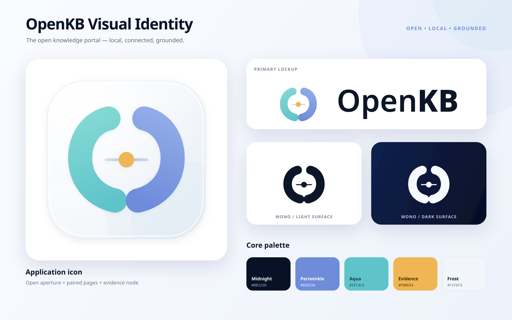

# OpenKB brand assets

OpenKB 的核心标识是一个“开放的知识入口”：两侧形体同时像打开的书页、
连接括号和未闭合的知识环；中央琥珀色节点代表回答中可追溯的证据。应用图标
采用浅雾色磨砂底板，符号本身保持扁平，避免高光、强阴影和厚重深色背景。



## 推荐用法

| 场景 | 首选文件 |
| --- | --- |
| 桌面应用、安装包、商店 | `openkb-app-icon.svg` / `openkb-app-icon.png` |
| 浅色背景 Logo | `openkb-logo-horizontal.svg` |
| 深色背景 Logo | `openkb-logo-horizontal-light.svg` |
| 方形或纵向版式 | `openkb-logo-stacked.svg` |
| UI 中的小型品牌符号 | `openkb-mark.svg` |
| 单色印刷、模板图标、特殊材质 | `openkb-mark-mono-dark.svg` / `openkb-mark-mono-light.svg` |
| 社交分享预览 | `openkb-social-card.png`（1200 × 630） |

SVG 是母版；PNG 用于不支持 SVG 的场景。`concepts/` 中的图片只保留设计过程，
不应替代最终矢量资产。

## 颜色

| Token | Hex | 用途 |
| --- | --- | --- |
| Midnight | `#081226` | 品牌文字、深色基底 |
| Periwinkle | `#6E8CDA` | 知识入口右侧、柔和主蓝 |
| Aqua | `#5FC4CA` | 知识入口左侧、连接感 |
| Evidence | `#F0B654` | 证据节点；只作少量强调 |
| Frost | `#F2F6FA` | 应用图标磨砂底板、浅色画布 |

界面仍以现有语义色 token 为准，不要把琥珀色扩展成普通按钮色；它专门表达
“证据、出处、已落点”的含义。

## 留白与最小尺寸

- Logo 四周至少保留一个中央证据节点直径的净空。
- 彩色标识最小建议尺寸为 24 px；16 px 托盘/标题栏场景使用平台导出的图标。
- 横版 Logo 最小建议宽度为 120 px。
- 不要旋转、压扁、重排两侧形体，也不要移除中央节点。
- 照片或复杂背景上优先使用应用图标，或使用单色版并确保清晰对比。

## 字标

字标使用 Noto Sans 的矢量轮廓：`Open` 为 SemiBold，`KB` 为 ExtraBold，
因此 SVG 不依赖用户设备上的字体。产品界面继续使用 Inter 及现有系统回退栈。

## 桌面平台导出

`desktop/src-tauri/icons/` 中包含由 1024 px 母版生成的 Windows、macOS 和
Tauri 常用 PNG 尺寸。需要重新生成时，在仓库根目录运行：

```bash
npm --prefix frontend exec -- tauri icon \
  "$PWD/assets/brand/openkb-app-icon.png" \
  -o "$PWD/desktop/src-tauri/icons"
```

该命令也会生成移动端目录；本项目是 Desktop 产品，不需要提交这些移动端导出。
