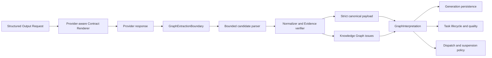

# Interpret model graph candidates before publication

OpenKB will treat Knowledge Graph model output as untrusted candidates rather
than as graph records. A provider-aware Contract Renderer will make the complete
structured-output contract visible to the provider, while one deep
`GraphExtractionBoundary` will parse, normalize, verify, and classify the
candidates before any result is published. This preserves OpenKB's stable graph
ontology and Evidence guarantees while allowing an evidence-safe subset to
complete explicitly as degraded instead of losing an entire document to one
recoverable relationship label.

## Context

The packaged Windows failure was not caused by import concurrency, SQLite, the
document parser, or malformed JSON. OpenKB attached a response schema and example
to its internal structured-output request, but the initial DeepSeek message
rendered only the prompt instructions and source material. DeepSeek's
`json_object` mode guarantees JSON syntax, not adherence to an unseen schema or
relationship enum. The model therefore returned syntactically valid graph edges
such as `LEADS` and `OPERATED_BY` outside OpenKB's canonical enum.

The local validator then collapsed unknown relationship types, self-edges,
unknown endpoints, and Evidence mismatches into the same generic
`Knowledge graph edge is invalid.` error. The single permitted repair received
the schema but not a precise issue path, repeated an invalid relationship, and
exhausted the operation. The task surfaced `knowledge_graph_response_invalid`
and suspended the exact operation contract even though safe candidates could
have been retained.

The earlier `model_service_unavailable` import outcome is a separate
provider-availability signal. The graph evidence does not establish that it has
the same cause, and this decision does not change transport-availability or
transport-retry semantics.

[Graphify at the reviewed commit](https://github.com/Graphify-Labs/graphify/tree/281ccaa4ff38aaef3f19e823fb7645e19b28f591)
demonstrates useful boundary patterns: put the requested graph shape and
relationships in provider-visible instructions, parse through one bounded
candidate layer, normalize and filter deterministically, preserve partial
results, and classify recovery by failure kind. OpenKB will adopt those patterns
without adopting Graphify's open relationship vocabulary, NetworkX storage, or
weaker Evidence semantics.

## Decision

### Render every structured contract for the provider

A shared, provider-aware Contract Renderer converts a Structured Output Request
and provider capabilities into the actual provider request. The rendered
contract includes the required JSON shape, field constraints, canonical
relationship enum, and a valid evidence-bound example. A schema or example
stored only on the internal request object does not count as rendered.

DeepSeek `json_object` plus this rendered contract remains the portable baseline.
A strict tool-call adapter may be introduced later only after its capability and
the full OpenKB schema vocabulary are verified. At the time of this decision,
DeepSeek's strict-tool schema subset does not cover constraints such as
`maxLength` and `maxItems` already used by OpenKB. Strict tools are therefore an
optimization, not a prerequisite for correctness and not a substitute for the
shared renderer.

The Knowledge Graph is the first atomic consumer of the renderer. Other
structured operations adopt it later with an explicit Prompt Contract version
bump per operation; rollout must not silently change every prompt at once.
The graph's one repair request renders both the repair contract and the parent
graph contract's instructions and semantic validation rules. A repair schema by
itself is insufficient because constraints such as exact support quotes and
same-Evidence edge endpoints are enforced outside JSON Schema.

### Expose one graph interpretation boundary

The graph subsystem exposes one semantic interface:

```text
GraphExtractionBoundary.interpret(content, evidence) -> GraphInterpretation
```

Bounded JSON parsing, candidate construction, lossless normalization, Evidence
verification, canonicalization, strict payload validation, issue construction,
and outcome classification are private to this module. Provider adapters do not
own graph semantics, and concurrency workers consume `GraphInterpretation`
outcomes without duplicating graph validation or repair policy.



### Separate source language from the canonical ontology

Stored relationships retain two distinct concepts:

- `edge_type` is the code-owned canonical relationship type used by retrieval.
- `relation_label` is the bounded source-facing relationship phrase proposed by
  the model and is never itself a query category.

Case, separators, and an unambiguous exact alias may be normalized losslessly
without degrading result quality. A relationship outside the canonical enum may
be retained as `RELATED_TO` only when its model-provided support quote is an
exact substring of the corresponding Evidence. Its original `relation_label`
is retained and its verification state is `ambiguous`. Otherwise the candidate
is rejected. Normalization must never infer a new domain-specific relationship.

Every model-generated node and edge requires its own bounded support quote in a
single EvidenceRef. OpenKB validates that quote locally, persists only the
EvidenceRef-relative character range as its Graph Support Locator, and does not
duplicate the quote text. Deterministically generated graph records are outside
this model-output rule.

Retained records receive a locally derived verification state:

- `source_anchored` for a canonical candidate with a validated locator;
- `ambiguous` for an evidence-anchored unknown label conservatively retained as
  `RELATED_TO`;
- `legacy_evidence_bound` for a migrated record that predates locator
  verification.

Model-reported confidence is not authoritative. Rejected candidates are not
persisted as graph records.

### Make partial success and empty success explicit

Extraction lifecycle and result quality are orthogonal. Lifecycle remains
`completed`, `completed_empty`, or `failed`; a completed result additionally has
quality `full` or `degraded`.

| Interpreted response | Lifecycle | Quality and disposition |
| --- | --- | --- |
| Explicitly valid response with no candidates | `completed_empty` | `full`; publish the empty generation |
| All candidates retained after only lossless normalization | `completed` | `full`; publish all records |
| At least one safe candidate retained and another weakened or rejected | `completed` | `degraded`; publish the safe subset and its issue summary |
| Nonempty response with every candidate rejected | `failed` | Publish no empty generation; repair first only when eligible |
| Top-level response remains unusable after an eligible repair | `failed` | Publish no generation |

An all-rejected nonempty response is never reclassified as `completed_empty`,
because absence of valid evidence is different from an explicit assertion that
the document contains no graph candidates.
Likewise, empty candidate arrays count as explicit empty success only when the
top-level object has exactly the contracted fields. Extra fields make the result
a repairable shape failure. JSON size and nesting are bounded before parsing so
pathological provider output cannot escape the interpretation boundary.

Deterministic parsing and normalization run before any model repair. The one
existing repair allowance is retained for an unusable top-level shape, a fake or
unresolvable Evidence reference, or another contract error that cannot be
interpreted locally. Unknown relationship labels do not spend the repair budget;
they follow the deterministic `RELATED_TO`-or-reject rule. Repair receives
precise issue codes and contract paths rather than one generic edge error.

### Persist quality without leaking source content

Every attempt records structured Knowledge Graph issues and disposition counts.
An issue contains a source-content-free code, contract path, disposition, and
failure class. Application logs contain only those codes, paths, and counts;
they do not contain support quotes, source excerpts, or raw relationship labels.
The UI exposes full/degraded quality, retained and rejected counts, and an
explicit retry action.

A generation's compatibility key consists of:

- Document Version and Evidence snapshot digest;
- canonical graph schema version;
- normalizer version;
- verification-policy version.

Provider, model, and Prompt Contract identity are deliberately excluded. When a
compatible full generation is already current, a later degraded attempt is kept
in history but does not displace it. If no compatible full generation exists, a
degraded generation may become current. Attempts are immutable and are never
merged, because cross-attempt merging would obscure provenance and could combine
incompatible interpretations.

### Scope failure before suspending dispatch

Evidence and semantic failures remain document-scoped. A Knowledge Graph
operation is suspended only after either a confirmed provider-protocol breach or
the same source-content-free structural Knowledge Graph Failure Signature occurs
for two independent documents. Once that threshold is reached, new requests for
the affected operation contract are blocked; already dispatched provider calls
finish and their results are interpreted normally rather than cancelled.

An explicit retry permit is bound to the exact suspension revision observed
when the user authorizes the retry. A successful retry may clear only that
revision. If another document creates a newer suspension while the provider call
is in flight, the safe graph result may still be published, but the older retry
cannot clear the newer suspension. Retry permits are ephemeral across the schema
migration and are never treated as durable proof after restart. Every Engine
activation deletes all persisted permits while preserving the suspended contract
states. A user retry action allocates a unique action scope, then publishes the
task scope, the parent graph permit, the exact bound-repair permit, and revocation
of any superseded scope in one SQLite transaction. No worker can observe a task
with only part of its authority, and failure at any point rolls back the whole
action. Provider dispatch may consume that authority but may never create or
rebind it. Completion, cancellation, interruption, and recovery clear the task
scope and revoke its permits in the same task-state transaction.

The revision rule is global to the model-operation ledger, so every repeatable
user action must use a unique stored scope. PageTree enrichment adopts the same
atomic action boundary in this migration; retaining its former deterministic
per-document scope would let an older revision block a later accepted retry.
Grounded Answer Regenerate likewise allocates a unique scope and binds the exact
Retrieval Plan, PageTree Selection, and parent-specific repair contracts before
retrieval begins. Nested retrieval dispatch may consume that authority but may
not create or rebind it, and a successful result cannot clear a suspension that
was created after the Regenerate action.

This is a Knowledge Graph-specific refinement of ADR-0046, with the shared
revision invariant applied to PageTree enrichment and Grounded Answer
Regenerate because they already expose repeatable user actions. Import and
Reanalysis retain ADR-0046's existing suspension semantics. Concurrency limits,
worker topology, and throughput tuning are separate decisions; the worker's
only new responsibility is to honor the interpreted dispatch outcome.

### Migrate existing graph data without a model call

The schema migration is additive, transactional, and model-free. Existing
canonical `edge_type` and Evidence bindings are preserved,
`relation_label` starts as `NULL`, verification becomes
`legacy_evidence_bound`, and the current-generation pointer does not move. Legacy
records do not satisfy the newer quote-verification policy merely because they
were migrated.

## Rollout and acceptance

The first implementation slice is one atomic graph-correctness release: shared
Contract Renderer support for the graph contract, the graph interpretation
boundary, additive migration, quality and issue persistence, UI reporting, and
an explicit graph Prompt Contract version bump. A prompt-only hotfix is not an
acceptable final state.

Acceptance requires a deterministic test matrix at
`GraphExtractionBoundary.interpret` covering malformed and truncated content,
all edge and Evidence issue paths, lossless aliases, unknown-label degradation,
partial retention, all-rejected failure, explicit empty success, repair
eligibility, compatibility-based promotion, migration, and two-document
suspension. Release verification also includes one explicitly authorized
DeepSeek smoke test using the packaged Windows application and a disposable
knowledge base. Paid provider calls do not run in CI.

This ADR was accepted after the deterministic matrix passed and the frozen
Windows Engine completed an authorized DeepSeek extraction against a disposable
copy of the affected knowledge base. That smoke result published 14 verified
nodes and 4 canonical edges as `degraded`, while rejecting 6 unsafe candidates
without failing the document or exposing source content in logs.

## Considered options

- **Keep strict whole-response rejection.** Rejected because one recoverable
  model label destroys unrelated evidence-safe candidates and turns ontology
  drift into document failure.
- **Adopt arbitrary relationship types as Graphify does.** Rejected because it
  makes retrieval semantics provider-dependent and allows uncontrolled ontology
  growth.
- **Map every unknown relationship to `RELATED_TO`.** Rejected because a mapping
  without exact source support invents graph meaning.
- **Patch only the Knowledge Graph prompt or DeepSeek adapter.** Rejected because
  the missing-contract defect is shared infrastructure and provider-specific
  prompt assembly would drift.
- **Require DeepSeek strict tool calls immediately.** Rejected as the baseline
  because it is provider-specific and does not currently cover every constraint
  used by OpenKB's schemas.
- **Always promote the newest attempt or merge attempts.** Rejected because a
  degraded retry could replace a known-full graph, while merging would erase the
  provenance of each immutable interpretation.

## Consequences

OpenKB gains provider-independent contract visibility, precise graph diagnostics,
evidence-safe partial results, and a clean concurrency seam. The cost is a new
candidate model, versioned normalization and verification policy, additive graph
metadata, UI quality states, and more migration and matrix testing. The canonical
ontology remains deliberately narrower than natural language, so some supported
relationships remain queryable only as `RELATED_TO` until a future explicit
ontology decision adds a new canonical type.

This decision refines ADR-0034's normalization and single-repair rule, makes
ADR-0042's DeepSeek JSON Output adapter safe through provider-visible contracts,
partially supersedes ADR-0046 only for Knowledge Graph suspension, clarifies
ADR-0047's empty-result semantics, and follows ADR-0050's model-free migration
rule.
