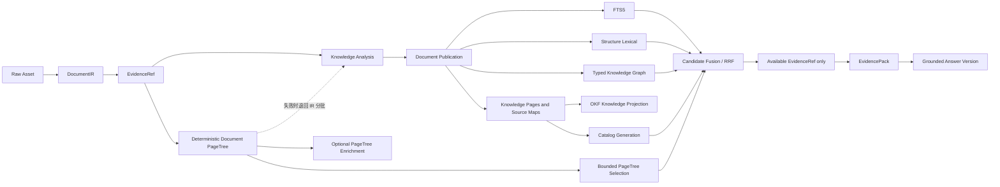
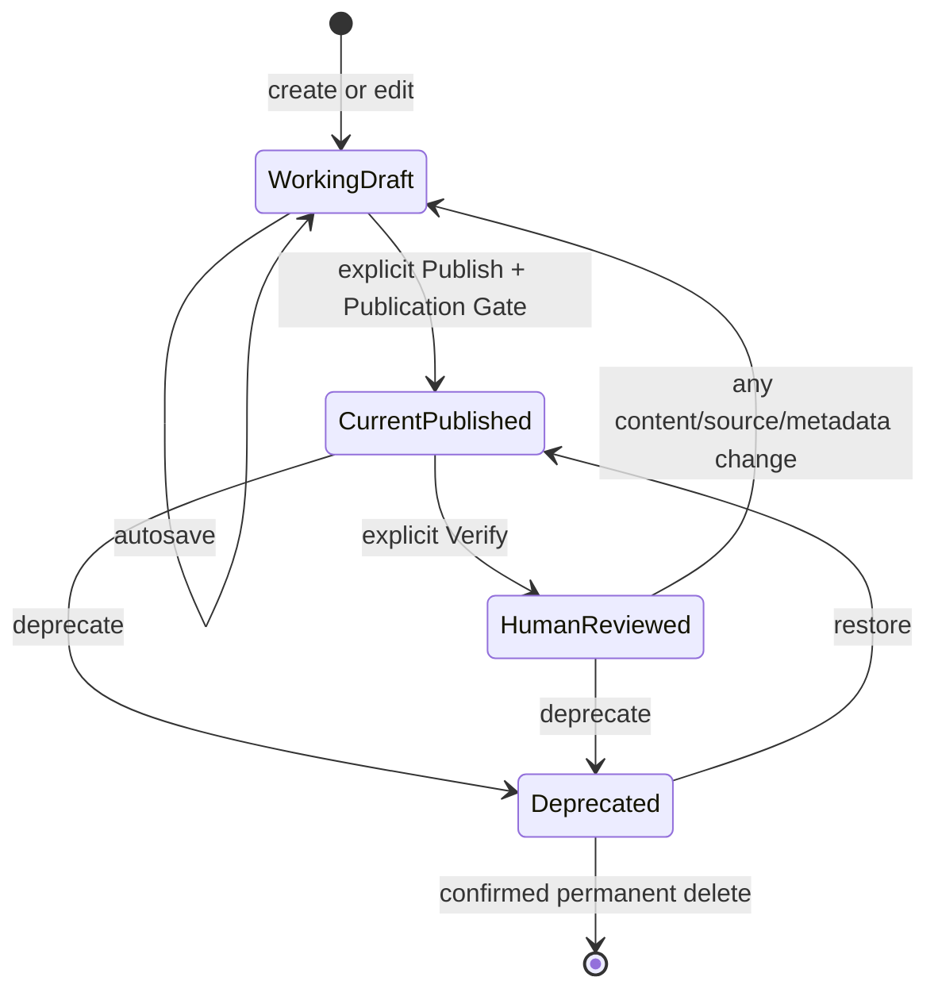

# OpenKB OKF 与 PageTree 知识组织升级设计

- 日期：2026-08-19
- 状态：已确认，待拆分实施
- 范围：知识组织、知识分析、OKF 投影、PageTree、vectorless 召回与知识页生命周期
- 研究依据：maintainer-local `docs/research/2026-08-19-okf-pageindex-integration-research.md`
- 上游基线：[OKF `fe3268a7`](https://github.com/GoogleCloudPlatform/knowledge-catalog/commit/fe3268a70e8ca5110a43a8f1dfdf6d1a458cf79f)，
  [PageIndex `ae2a5b49`](https://github.com/VectifyAI/PageIndex/commit/ae2a5b49b5411903633faa299201d6ba1769fd2f)
- OpenKB 基线：`2db650c101a8313df2b23af1323cb709182e6db4`

## 1. 决策摘要

OpenKB 采用“SQLite 权威状态 + OKF 开放投影 + PageTree 分层定位 +
EvidenceRef 最终取证”的组合架构。

- SQLite 继续是知识、修订、证据、导入状态、冲突处理、图谱和派生代次的唯一权威源。
- `knowledge-pages/` 升级为可丢弃、可重建的 OKF v0.2 兼容投影，不成为第二套数据库。
- OKF Catalog 回答“有哪些知识以及它们如何组织”；Document PageTree 回答“相关原文位于哪份文档的哪个结构节点”。
- PageIndex 只作为可替换的实验性 `PageTreeProvider`，不能接管文档解析、存储或最终回答。
- Knowledge Page 可参与查询规划、候选扩展和排序，但回答模型看到的事实材料仍只能是可用原文 EvidenceRef。
- 召回保持 vectorless，不引入 Embedding 模型、向量索引或向量数据库。
- 当前名为 `page_tree` 的词面实现改称 `structure_lexical`；真实树检索使用 `document_page_tree`，避免评测混淆。
- `model_analysis` 继续作为导入前的强制可恢复阶段，但升级为产出可发布知识的结构化 Knowledge Analysis。
- 用户知识页采用 Current Published Revision 与 Working Draft 分离；自动保存不等于发布，发布不等于人工验证。
- 普通删除先进入可恢复的 `deprecated`；永久删除是独立的二次确认动作。

本设计补充既有桌面与本地图谱设计。发生冲突时，仅在知识组织、知识页来源、
Knowledge Analysis、OKF 投影和 PageTree 召回范围内以本设计及 ADR 0025–0029 为准。

## 2. 目标与非目标

### 2.1 目标

1. 给 Concept、Entity 和当前已发布生成知识建立开放、可读、稳定的 Markdown 组织方式。
2. 把来源、生命周期、人工验证和逐声明引用纳入知识页模型。
3. 用 DocumentIR 构建多格式统一的层级定位能力，并为 PageIndex 保留窄适配边界。
4. 在无 Embedding 的前提下，提高长文档、多跳和跨文档问题的证据召回质量。
5. 保持导入阶段可恢复、失败可降级、问答证据可追溯、桌面离线数据可迁移。
6. 让 Knowledge Analysis 的模型成本、超时、批次进度和恢复行为可观察、可控制。
7. 为知识页导出提供知识投影包和自包含包两种明确产品能力。

### 2.2 非目标

- 不把上游 OKF reference agent、viewer、BigQuery connector 或 Gemini crawler 引入运行时。
- 不把 `index.md`、Knowledge Page、节点摘要或 Catalog 摘要作为 Answer Evidence。
- 不在首版导入外部 OKF Bundle，也不允许直接编辑投影 Markdown 后反向写入 SQLite。
- 不用 OKF 无类型链接替代 OpenKB 有类型、证据绑定的知识图谱。
- 不让 PageIndex 重新解析 OpenKB 已转换的完整原文，也不使用 PageIndex Chat 生成最终答案。
- 不实现 OKF Attested Computation、执行器、证明器或通用计算沙箱。
- 不要求每个知识库初始化 Git。
- 不自动为旧知识页推断整篇文档级证据，不伪造来源或验证状态。
- 不在首版设置页暴露 PageTree 触发阈值和融合权重。

## 3. 强不变量

1. **单一权威源**：所有可变业务状态先原子提交到 SQLite；Markdown 和 provider 私有文件只能由权威状态重建。
2. **来源优先**：进入 EvidencePack 的内容必须解析到 Available Knowledge 中的原文 EvidenceRef。
3. **身份稳定**：标题、描述、标签、目录和逻辑 Catalog 变化不能改变 Page ID、Item Key 或 OKF Concept ID。
4. **修订不可混淆**：Working Draft、Current Published Revision、历史修订和候选内容具有不同生命周期。
5. **验证不可继承**：内容、来源、生命周期或受控元数据发生改变时，旧 `verified` 对新修订失效。
6. **操作状态与知识状态分离**：导入中、重试、隔离属于 Import Job；`draft/stable/deprecated` 属于已发布知识。
7. **派生能力可降级**：Catalog、PageTree Enrichment、PageTree Selection、OKF 投影或图谱失败不能污染权威数据，也不能移除已可用文档。
8. **D2 不增加支持度**：重复 Evidence 的多个 occurrence 只算一个规范支持，但任一可用 occurrence 均可承担引用。
9. **无向量依赖**：所有候选生成、扩展、融合和评测均不得暗中依赖 Embedding。
10. **旧答案可复现**：Answer Version 保存必要的 Retrieval Trace 标识，不依赖当前树代次才能显示历史答案。

## 4. 领域模型

| 对象 | 含义 | 权威位置 | 是否可重建 |
|---|---|---|---|
| Raw Asset | 导入后保留的唯一完整原始文件 | `raw/` + SQLite 完整性元数据 | 否 |
| DocumentIR | 解析后的统一结构块、定位和媒体关联 | SQLite | 可由 Raw Asset 重建 |
| EvidenceRef | 可供检索和回答引用的规范原文证据 | SQLite | 可由 DocumentIR 重建 |
| Knowledge Analysis | `model_analysis` 的结构化、带来源分析结果 | SQLite checkpoint | 可显式重分析 |
| Knowledge Page | Concept 或 Entity 的稳定身份 | SQLite | 否 |
| Working Draft | 可自动保存但尚未发布的用户编辑 | SQLite | 否 |
| Current Published Revision | 当前对读者和路由可见的修订 | SQLite | 否 |
| Knowledge Source Map | 修订内 source ID 到规范 Evidence ID 的映射 | SQLite | 否 |
| Catalog Generation | 某个已发布知识快照的确定性 Catalog | SQLite | 是 |
| Document PageTree | 绑定单一 Document Version 的层级定位树 | SQLite | 是 |
| OKF Knowledge Projection | 权威知识的 Markdown 投影 | `knowledge-pages/` | 是 |
| Retrieval Trace | 一次回答使用的代次、通道、降级和选择记录 | SQLite Answer Version | 否 |

### 4.1 两棵树

系统明确区分两类树：

- **Catalog Tree**：语料级目录，路由到已发布 Concept、Entity 和 Source Document。
- **Document PageTree**：文档级结构，路由到章节、表格、图片和 EvidenceRef。

Catalog Tree 不包含完整原文；Document PageTree 不承担跨语料知识分类。两者都由 SQLite
快照生成并具有不可变 generation identity。

## 5. 总体架构



从 Knowledge Page、Catalog、PageTree 或图谱得到的文本只用于路由。候选必须回源到
Available EvidenceRef，才能进入 EvidencePack。

## 6. 导入 DAG 与 Knowledge Analysis

### 6.1 阶段顺序

持久化阶段名保持兼容：

```text
preflight
  → raw_asset
  → document_ir
  → evidence
  → deterministic_page_tree
  → model_analysis
  → search_and_publish
```

`deterministic_page_tree` 是非阻断 checkpoint：成功时与文档一同发布；失败时使用有序
DocumentIR 分批继续 Knowledge Analysis，文档发布后再排队重建。它不进入失败文档隔离流程。

`model_analysis` 的 UI 名称为“Knowledge Analysis / 知识分析”，数据库阶段名不迁移。

### 6.2 结构化输出

每次成功分析必须通过版本化 schema，至少包含：

- 文档描述；
- Concept 候选；
- Entity 候选及可选规范 subtype；
- aliases 与 tags 建议；
- claim units；
- 每个 claim 的 `source_evidence_ids`；
- schema 版本和分析范围。

图谱关系抽取、PageTree Enrichment 和回答生成不属于该 schema。它们是独立、可降级的后续能力。

合法结果可以没有 Concept、Entity 或可发布 claim；只要文档描述和 schema 合法，文档仍发布，
并进入 Evidence、FTS、Structure Lexical 和 PageTree 检索。系统不得为满足非空结果而制造知识。

### 6.3 长文档批次与恢复

长文档按 DocumentIR 或 Document PageTree 的自然章节切为 Knowledge Analysis Batch：

1. 每个批次单独产生并校验规范化结构结果。
2. 完成批次立即 checkpoint；后续失败时不重跑已完成批次。
3. 全部批次结束后执行一次有界的文档级合并。
4. 恢复只继续未完成批次或最终合并。

checkpoint 保存：结构化结果、schema 版本、provider、model、prompt digest、engine version、
Model Attempt 元数据和响应散列。不再保存一份完整自由文本请求/响应。

### 6.4 超时、重试与隔离

| 失败类别 | 处理 |
|---|---|
| API 等待超时、网络中断、限流、服务端错误 | 首次调用之外最多自动重试 3 次；每次请求超时增加 10 秒；每个逻辑调用总等待上限 60 秒 |
| 鉴权、模型配置、provider 配置错误 | 直接隔离，不自动重试 |
| schema 不合法、响应无法解析 | 作为格式错误直接隔离，不自动重试 |
| schema 合法但个别 claim 无可解析证据 | claim 进入 Missing Source Candidate；其余内容和文档继续发布 |
| Deterministic PageTree 失败 | 不隔离，退回 DocumentIR 分批并安排重建 |
| PageTree Enrichment 失败 | 只记录 Task Center，文档仍可用 |
| 已发布文档的 Knowledge Reanalysis 失败 | 保留原知识和文档可用状态，不隔离 |

首次模型调用不计入“3 次重试”。每次 UI 都展示当前尝试、超时时间、剩余逻辑调用预算和下一次动作。

### 6.5 复用、过期与重分析

- D0/D1 默认复用规范内容已经完成且带来源的 Knowledge Analysis，并在使用时选择可用 occurrence。
- 显式 Knowledge Reanalysis 总是允许；新结果形成候选并进入正常 Knowledge Reconciliation。
- schema、prompt 或 engine 变化把旧结果标记为 `analysis_outdated`，但不使当前知识或文档失效。
- Documents 和 Task Center 提供单份及批量重分析；升级不会自动产生未经用户同意的模型费用。
- 旧修订若没有 Knowledge Source Map，标记为 `legacy_unmapped`，保持可浏览和路由，不获得虚构证据。

OKF 的 `generated.by` 使用稳定的 `openkb-knowledge-analysis/<schema-version>`；具体 provider、model、
prompt digest 和 engine version 放在 `openkb:` 扩展中。

## 7. Knowledge Page 生命周期



### 7.1 Draft、发布与验证

- 一个 Knowledge Page 最多有一个 Current Published Revision 和一个 Working Draft。
- 自动保存只写 Working Draft；只有显式 Publish 才原子推进 Current Published Revision。
- 用户编辑时，旧 Current Published Revision 继续可见、可路由，直到新 Draft 发布。
- 来源完整的自动生成知识可直接发布为 `stable + unverified`。
- Verify 是发布后的独立人工动作，且绑定确切 revision。
- 修改正文、Source Map、生命周期、description 或 tags 后，必须重新验证。
- 首版只记录 human verification，不从模型调用成功推断 `machine-confirmed`。

### 7.2 生命周期语义

- `draft`：不进入 OKF 发布投影、默认检索或回答。
- `stable`：正常参与 Catalog 和路由。
- `deprecated`：保留在投影和历史中，默认路由排除，可由用户恢复。
- `stale_after` 已到期：在 OKF/Wiki 路由中降权，但原文 EvidenceRef 仍可独立召回。

Knowledge Trust Tier 只能作为轻量 Catalog tie-breaker，不能覆盖相关度、Evidence Availability、
protected baseline quota 或引用正确性。

### 7.3 删除与历史

常规删除改为 Knowledge Deprecation。永久删除位于次要操作区，需要单独确认，并删除该页身份、
Working Draft、发布修订和历史修订。已丢弃候选的正文按既有规则删除，但 Resolution Record 和
不含候选正文的操作历史继续保留。

### 7.4 再导入与三方协调

当新导入知识命中已有 Knowledge Page：

- 没有 Working Draft 时，比较 Current Published Revision 与 incoming candidate。
- 存在 Working Draft 时，执行 Current Published Revision、Working Draft、incoming candidate
  的 Three-way Knowledge Reconciliation。
- 冲突动作包括保留 Draft、应用 incoming、以 incoming 替换、手动合并。
- 协调结果只修改 Working Draft，仍需显式 Publish。
- 相似候选只用于提示/审核，不能执行传递式自动实体合并。

## 8. 逐声明来源与 Publication Gate

### 8.1 Claim Unit

事实声明按可独立验证的 Markdown 单元划分：段落、列表项、表格行等。标题、导航和纯结构文本不要求来源。

SQLite 中的权威修订同时保存：

1. 带 OKF footnote marker 的 `content_markdown`；
2. 同一事务内写入的 Knowledge Source Map；
3. marker 诊断和 Publication Gate 结果。

Source ID 从 canonical Evidence ID 稳定派生，例如 `src-<digest>`。内容重排或修订不会改变同一证据的
Source ID；具体 occurrence 只在查询或引用时按 availability 选择。

### 8.2 编辑体验

保持 Markdown 编辑器，不引入另一套结构化页面编辑器。来源面板允许用户：

1. 选择一个 claim unit；
2. 按文档名和章节搜索 Available Knowledge；
3. 选择 EvidenceRef；
4. 自动插入 footnote marker 并更新 Knowledge Source Map。

专家可手写 marker，但必须经过相同校验。未解析 marker 可以保存为带诊断的 Draft Revision，
不能发布为 stable、不能验证、不能进入回答。

### 8.3 动态可用性

如果已发布 revision 的某个来源后来不可用，系统不篡改历史修订。Publication Gate 在查询时动态排除
受影响 claim；来源恢复后自动恢复资格。

一个 claim 可以有多个 EvidenceRef。D2 duplicate 只计一次支持度；只要至少一个独立规范来源仍有
可用 occurrence，该 claim 仍可路由。

### 8.4 回答边界

Source-backed Knowledge Claim 的改写文本只用于规划、扩展和排名。它不能直接进入回答模型。
解析得到的原文 EvidenceRef 才能进入 EvidencePack，并继续显示文档名、章节、locator 和相关图片。

无来源的个人笔记可以保存并在知识页中显示，但只参与人工浏览，不参与回答。

### 8.5 Missing Source Candidate

模型产生但无法绑定 Available EvidenceRef 的 claim 进入现有 Review Queue 的
`missing_source` 分类：

- 单条绑定来源；
- 批量 dismiss；
- 绑定成功后进入 Working Draft 或生成候选；
- dismiss 后删除候选正文，保留 Resolution Record。

不新增独立顶级菜单或第二个审核中心。

## 9. OKF Knowledge Projection

### 9.1 投影范围

投影只包含：

- 已发布 Concept；
- 已发布 Entity；
- 当前已发布的 generated knowledge；
- stable 与 deprecated Current Published Revision；
- 确定性生成的 `index.md` 和 `log.md`。

不包含 Working Draft、待审核候选、已丢弃正文、Raw Asset 的重复 Markdown 副本、Evidence Page、
Import Job 或对话记录。

### 9.2 固定物理目录

```text
knowledge-pages/
  index.md
  log.md
  concept/
    index.md
    <stable-page-id>.md
  entity/
    index.md
    <stable-page-id>.md
  generated/
    index.md
    concept/
      index.md
      <stable-item-key>.md
    entity/
      index.md
      <stable-item-key>.md
```

物理路径只由稳定身份和固定 kind 决定。逻辑主题、分类、title、description 和 tags 的变化只更新
Catalog，不移动文件。普通相对 Markdown 链接是默认输出；读取器同时兼容普通相对链接和 OKF
bundle-root `/...md` 链接。

### 9.3 字段映射

Concept 使用 `type: Concept`。Entity 使用规范 subtype，例如 `Person`、`Organization`、`Product`；
没有 subtype 时使用 `type: Entity`，并始终保留 `openkb.kind: Entity`。

所有 OpenKB 专有扩展都嵌套在 `openkb:`，不在 OKF 顶层散布私有字段。

```yaml
---
type: Person
title: 张三
description: 负责本地知识库桌面产品的维护。
tags:
  - OpenKB
status: stable
generated:
  by: openkb-knowledge-analysis/1
  at: 2026-08-19T10:00:00Z
verified:
  - by: human:local-user
    at: 2026-08-19T10:30:00Z
sources:
  - id: src-6f2a9b1c
    resource: urn:sha256:<raw-asset-sha256>
    title: 产品说明 / 团队
    openkb:
      canonical_evidence_id: <evidence-id>
      document_id: <document-id>
      locator:
        heading_path: [团队]
openkb:
  kind: Entity
  page_id: <stable-page-id>
  revision: 3
  authority: user_revision
  analysis:
    provider: <provider>
    model: <model>
    prompt_digest: <digest>
---

张三负责维护 OpenKB 桌面产品。[^src-6f2a9b1c]

[^src-6f2a9b1c]: 产品说明 / 团队
```

`description`、`tags` 可由 Knowledge Analysis 建议，再由用户修订。修改后使旧 verification 失效。
`status` 和 `stale_after` 只由用户操作或显式策略决定，不能由模型自行推断。

`legacy_unmapped` 页面可投影，但必须带 `openkb.provenance: legacy_unmapped`，不得填充虚构
`sources` 或 `verified`。

### 9.4 index 与 log

- 根 `index.md` 保留 `okf_version: "0.2"`，重复物化不能覆盖该 frontmatter。
- 所有目录的 `index.md` 从同一 SQLite Published Snapshot 确定性生成。
- `index.md` 只包含稳定链接、title 和 description 等渐进披露信息。
- `log.md` 从 revision、generation、lifecycle 与 Resolution Record 元数据生成。
- `log.md` 不保存已丢弃候选正文，也不承担审计数据库职责。

### 9.5 两层校验

**OKF Compatibility Lint** 只检查 OKF 规范要求：可解析 frontmatter、非空 `type`、保留文件结构等；
它宽容未知字段、未知 type、缺失可选字段和断链。

**OpenKB Publication Gate** 检查本地强不变量：source marker 可解析、EvidenceRef 可用、生命周期可发布、
修订与 generation 一致、必要事实 claim 有来源等。

不得把 OpenKB Publication Gate 宣称为通用 OKF 格式规则。

## 10. OKF 导出

### 10.1 Knowledge Projection Export

包含 OKF Markdown、`index.md`、`log.md` 和 source manifest，不复制 Raw Asset。

`sources[].resource` 使用稳定的 `urn:sha256:<raw-hash>`。manifest 记录资源身份、原始显示名、格式、
可用性和 OpenKB source mapping，不写入机器绝对路径。

### 10.2 Self-contained Knowledge Bundle

在 Knowledge Projection Export 基础上，只复制被已发布知识实际引用的 Raw Asset 和 Source Image，
并把 `sources[].resource` 改写为 Bundle 内的相对 `raw/` 路径。未引用的完整文档不复制。

### 10.3 共同规则

- 只导出 Current Published Revision；stable 和 deprecated 都保留。
- 不导出 Working Draft、候选或 discarded content。
- deprecated 内容保留历史可读性，但消费者应默认排除其路由。
- 导出是快照，不改变 SQLite 权威身份。
- 首版不支持将外部修改后的 Bundle 回写到知识库。

## 11. PageTreeProvider 与派生代次

### 11.1 Provider 边界

`PageTreeProvider` 是 OpenKB 自有接口。输入只包含规范 DocumentIR、locator 与 EvidenceRef binding；
输出归一化为：

```text
PageTreeGeneration
  generation_id
  document_version_id
  provider_kind
  provider_version
  structural_ir_fingerprint
  locator_mapping_digest
  created_at
  status

PageTreeNode
  node_id
  parent_node_id
  order
  kind
  title
  optional_summary
  locator
  evidence_ids[]
  source_image_ids[]
```

节点不保存另一份完整来源文本。Table 和 Figure 节点保留 EvidenceRef、locator 和 Source Image 关联。

### 11.2 基础实现与实验实现

1. 首版基础 provider 根据 DocumentIR 确定性构建层级树，不调用 LLM。
2. PageTree Enrichment 可在文档 available 后异步生成节点摘要。
3. 官方 PageIndex adapter 位于同一 provider seam 后，仅作为实验实现。
4. provider 私有 `.pageindex` 或其他文件只能作为临时缓存，不得成为权威源。

PageTree Enrichment 是 Task Center 中的低优先级可恢复任务，不出现在 Failed Documents。
其摘要只用于路由，永不进入 EvidencePack。

### 11.3 复用与保留

- Document PageTree 绑定不可变 Document Version。
- D1 只有在 `structural_ir_fingerprint` 与 `locator_mapping_digest` 都相同的情况下复用。
- 仅正文规范化散列相同不足以证明页面、slide、sheet、table 或图片定位相同。
- 每个 Document Version 保留当前有效 PageTree；重建期间暂留前一代。
- Catalog 保留当前代和最近成功代。
- 活跃请求释放后清理更早的派生代次。
- Answer Version 只保存 generation IDs 和选择轨迹，不复制树体。

## 12. Catalog Generation

Catalog 从当前 Published Snapshot、Knowledge Metadata、Knowledge Source Map、Document Availability
和 Source Document 元数据确定性生成，不调用 LLM。

以下事件使 Catalog 失效并排队重建：

- Publish Knowledge Revision；
- deprecate、restore 或 permanent delete；
- Knowledge Source Map 变化；
- Document Availability 变化；
- Knowledge Reanalysis 成功。

Working Draft、Conversation、Message 和 Answer Version 不触发 Catalog rebuild。

Catalog 构建失败不能回滚已经提交的知识发布。上一个 generation 以 stale 状态继续服务，后台持久化
任务重试；新的 revision 同时已经能被直接 SQLite、Wiki 和 FTS 路径读取。

OKF 普通 Markdown links 只作为低权重、最多一跳的 Catalog navigation。它们无类型，也不转写为
typed Knowledge Graph edge。图谱边仍必须绑定 EvidenceRef。

## 13. Vectorless 检索流程

### 13.1 基线先行

每个问题先运行确定性基线：

1. FTS5；
2. Structure Lexical；
3. deterministic Catalog / Wiki metadata；
4. 受预算约束的 typed Knowledge Graph local channel。

旧 `page_tree` variant 必须改名为 `structure_lexical`。只有使用持久化
Document PageTree 的通道才能称为 `document_page_tree`。

### 13.2 PageTree Selection 触发

仅当问题具有长文档、结构复杂、多跳、歧义、基线 coverage 低或候选冲突等特征时，才触发
PageTree Selection。阈值由固定评测驱动并写入 diagnostics，首版不暴露设置 UI。

每个问题最多：

- 1 次 PageTree Selection Model Call；
- 选择 3 棵 Document PageTree；
- 20 秒 deadline；
- 0 次自动重试。

超时或失败立即采用已完成的确定性基线，不向普通用户暴露内部失败。

PageTree Selection 复用当前 Knowledge Base 的 Model Configuration、Model Gateway 和日志，不新增
独立 provider/model 配置。

### 13.3 融合与证据保护

所有通道输出统一 EvidenceCandidate，按 canonical Evidence ID 去重，再用 RRF 或评测确定的
校准策略融合。

- 基线候选有 protected quota，增强通道不能完全替换它们。
- OKF link expansion 最多一跳。
- graph、PageTree、Catalog 或 OKF metadata 失败只移除相应通道。
- 最终 EvidencePack 只含 available source evidence。
- 生成答案末尾继续展示文档名、章节、locator 和被引用的原文图片。

### 13.4 Retrieval Trace

每个 Answer Version 保存：

- 使用的 Catalog generation IDs；
- 使用的 Document PageTree generation IDs；
- 每个通道的触发原因、候选数和降级原因；
- PageTree Selection 选择的 node IDs；
- 最终 canonical Evidence IDs；
- 融合策略版本。

历史答案显示只依赖已保存的 Answer Version、Evidence Snapshot 和 Source Image Snapshot，不要求旧树体仍存在。

## 14. 桌面体验

### 14.1 Knowledge 编辑器

保持一个知识工作区，并提供：

- Markdown 正文编辑与自动保存 Working Draft；
- Publish；
- Verify；
- source binding 侧栏；
- Publication Gate diagnostics；
- deprecate、restore 和二次确认 permanent delete；
- 冲突时的 Three-way Reconciliation；
- `legacy_unmapped` 和 `missing_source` 状态提示。

不会新增第二套“结构化知识编辑器”。

### 14.2 Documents 与 Task Center

Documents 显示 Knowledge Analysis schema/version、是否 outdated、最近分析模型、批次进度和显式 Reanalyse。
Task Center 显示：

- Knowledge Analysis Batch；
- Catalog rebuild；
- Deterministic PageTree rebuild；
- PageTree Enrichment；
- 批量 Knowledge Reanalysis。

只有阻断首次导入发布的 Knowledge Analysis 失败进入 Failed Documents。Catalog、Enrichment、已发布文档
Reanalysis 等派生任务失败不改变 Document Availability。

### 14.3 导出

知识库操作区提供两种明确动作：

- 导出 Knowledge Projection；
- 导出 Self-contained Knowledge Bundle。

UI 必须说明第二种仅复制当前已发布知识引用的 Raw Asset 与 Source Image，而不是整个知识库备份。

## 15. 故障、恢复与可观察性

### 15.1 失败降级矩阵

| 能力 | 失败后的用户可用能力 | 是否隔离文档 |
|---|---|---|
| 首次 Knowledge Analysis | 失败文档可手动恢复 | 是，按既有错误分类 |
| Deterministic PageTree | IR batching、FTS/Structure Lexical | 否 |
| PageTree Enrichment | 基础树仍可用 | 否 |
| Catalog rebuild | 上一 Catalog + 直接 SQLite/Wiki/FTS | 否 |
| PageTree Selection | 已完成的确定性基线 | 否 |
| typed graph extraction/retrieval | 文档检索继续 | 否 |
| OKF materialization | SQLite 知识与问答继续，安排重建 | 否 |
| Published document Reanalysis | 原知识和文档继续 | 否 |

### 15.2 日志与诊断

日志不得记录 API Key 或完整敏感原文。需要记录：

- job/stage/batch/call/generation IDs；
- provider、model、schema、prompt digest、engine version；
- timeout、attempt、remaining logical budget；
- provider category、exception type 和可安全诊断详情；
- PageTree/Catalog trigger、degradation 和 rebuild reason；
- Publication Gate 的稳定错误码；
- Retrieval Trace 摘要。

普通问答不弹出图谱、PageTree 或 Catalog 内部失败；详细信息进入诊断日志和任务状态。

## 16. 迁移与兼容

1. 不迁移旧问答数据；既有 Answer Version 按原契约保留或由现有生命周期处理。
2. 已有 knowledge revision/generation 不推断 claim-level evidence，标记 `legacy_unmapped`。
3. 现有 `kind` 映射为 OKF `type`，原有稳定 `page_id/item_key` 继续作为文件身份。
4. 重建 `knowledge-pages/` 时只从 SQLite 当前发布快照生成，不读取旧投影作为权威输入。
5. 现有 `page_tree` 检索与评测标签迁移为 `structure_lexical`；不得在报告中把历史结果称为 PageIndex。
6. 首次 schema 升级后生成 deterministic PageTree 和 Catalog；失败不阻止打开知识库。
7. Knowledge Reanalysis 是旧知识获得 Source Map 的唯一自动化升级路径；用户也可手动绑定来源。
8. 外部 OKF import 与双向 Markdown 同步继续 deferred，需要单独设计身份和冲突协议。

## 17. PageIndex Provider 启用门槛

官方 PageIndex adapter 在满足以下固定评测前不进入默认包、不默认启用：

### 17.1 问题集

- local fact；
- multi-hop；
- cross-document conflict；
- global theme；
- absent answer；
- 重点覆盖长文档与复杂层级文档。

### 17.2 质量与性能门槛

- 长文档 Evidence Recall@6 相对基线提升至少 10%；
- citation precision 回退不超过 1 个百分点；
- absent-answer 正确拒答回退不超过 1 个百分点；
- 新增 retrieval p95 不超过 10 秒；
- Windows 冷启动 p95 增量不超过 1 秒；
- PyInstaller onedir 体积和 native dependency 可接受；
- timeout、provider error 和 tree corruption 均能立即降级；
- 不改变 EvidencePack 和 immutable Answer Version 契约。

评测必须分别报告 `structure_lexical`、`document_page_tree`、
`catalog + document_page_tree`，不能用同名 variant 混合不同实现。

## 18. 分阶段交付

### Phase A：知识模型与 OKF 投影

- Working Draft / Current Published Revision / Verify / lifecycle；
- claim marker 与 Knowledge Source Map；
- Publication Gate 与 OKF Compatibility Lint；
- 固定目录、frontmatter、index/log 的确定性物化；
- Knowledge Projection Export 与 Self-contained Knowledge Bundle；
- 旧知识 `legacy_unmapped`。

### Phase B：Knowledge Analysis

- versioned structured schema；
- natural-section batching 与 checkpoint；
- source-backed candidate publication；
- Missing Source Candidate；
- D0/D1 reuse、outdated 标识和显式 Reanalysis；
- Three-way Reconciliation。

### Phase C：确定性 PageTree 与 Catalog

- `PageTreeProvider` seam；
- DocumentIR provider；
- immutable generations、invalidation、retention；
- Catalog rebuild 与 stale fallback；
- `page_tree` 重命名为 `structure_lexical`。

### Phase D：检索增强与评测

- bounded PageTree Selection；
- RRF/protected baseline；
- Retrieval Trace；
- PageTree Enrichment；
- 固定问题集与消融评测。

### Phase E：PageIndex 实验适配

- 固定版本 adapter；
- Windows onedir 冷启动、体积和依赖验证；
- 质量/延迟/降级门禁；
- 仅在全部门槛通过后讨论默认启用。

## 19. 验收标准

1. SQLite 删除 `knowledge-pages/` 后可重建完全一致的当前投影，且不会反向读取 Markdown 恢复权威状态。
2. 任意投影 Concept/Entity 都有非空 `type`，OpenKB 扩展只位于 `openkb:`。
3. 页面改名、重新分类、修改 description/tags 不改变 Concept ID 或破坏入链。
4. 根 `okf_version` 在重复生成 index 后保留；所有 index 与同一 Published Snapshot 一致。
5. Working Draft 自动保存不改变当前发布内容；Publish 失败不产生半提交投影。
6. Verify 只绑定确切 revision，任何内容、来源、生命周期或受控元数据变化都会使其失效。
7. 每个可回答事实 claim 的 marker 都解析到 Knowledge Source Map 和 available canonical Evidence。
8. 不可用来源不改写历史 revision，但会动态阻止受影响 claim 进入回答；恢复来源后资格恢复。
9. D2 occurrences 不增加支持度；规范 owner 不可用时仍可从另一个 available occurrence 引用。
10. 首次 Knowledge Analysis 使用已确认的超时、3 次重试和直接隔离分类，完成批次不会重跑。
11. 合法但空候选的 Knowledge Analysis 仍可发布文档；unsupported claim 不隔离整份文档。
12. 旧 revision 不获得推断来源；重分析或手工 binding 后才可进入 source-backed answer routing。
13. Deterministic PageTree、Catalog、Enrichment、Graph 和 PageTree Selection 任一失败时，FTS/
    Structure Lexical 基线仍可回答，普通用户不看到内部失败。
14. PageTree 节点没有完整原文副本，Table/Figure 能回到 locator、EvidenceRef 和 Source Image。
15. D1 只有结构指纹和定位映射均一致才复用 Document PageTree。
16. PageTree Selection 每题最多一次、最多三棵树、20 秒、无自动重试。
17. 所有融合结果在进入 EvidencePack 前按 canonical Evidence 去重并通过 availability gate。
18. 历史 Answer Version 能在派生树清理后继续显示原答案、引用和图片。
19. Knowledge Projection Export 不包含 Raw Asset；Self-contained Bundle 只包含被引用的 Raw Asset/Image。
20. 不安装或配置任何 Embedding 模型即可完成导入、检索、问答和所有评测。

## 20. 关联决策

- [ADR 0006：知识页编辑保存为用户修订](../adr/0006-store-knowledge-page-edits-as-user-revisions.md)
- [ADR 0007：重新导入使用人工审核冲突协调](../adr/0007-reconcile-reimports-with-user-reviewed-conflicts.md)
- [ADR 0008：删除未选择候选正文](../adr/0008-delete-unselected-knowledge-candidate-content.md)
- [ADR 0021：采用无向量的规划式多通道召回](../adr/0021-use-vectorless-planned-multichannel-retrieval.md)
- [ADR 0023：模型配置保存在知识库配置中](../adr/0023-store-model-configuration-in-knowledge-base-config.md)
- [ADR 0024：持久化对话与不可变回答版本](../adr/0024-persist-conversations-and-immutable-answer-versions.md)
- [ADR 0025：投影 OKF 知识并隔离 PageTree provider](../adr/0025-project-okf-knowledge-and-isolate-page-tree-providers.md)
- [ADR 0026：回答只使用有原文来源的知识声明](../adr/0026-require-source-backed-knowledge-claims-for-answers.md)
- [ADR 0027：分离 OKF 兼容与发布资格](../adr/0027-separate-okf-compatibility-from-publication-eligibility.md)
- [ADR 0028：永久删除前先废弃已发布知识](../adr/0028-deprecate-published-knowledge-before-permanent-deletion.md)
- [ADR 0029：让模型分析产出可发布知识](../adr/0029-make-model-analysis-produce-publishable-knowledge.md)

## 21. 已推迟议题

以下内容不属于本设计的默认实施范围：

- 外部 OKF Bundle import；
- 双向 Markdown/SQLite 同步；
- 外部 OKF identity federation；
- OKF Attested Computation；
- 自动机器验证；
- Embedding/vector recall；
- PageIndex 作为强制运行依赖；
- 面向用户的 PageTree 阈值和融合权重设置。

它们需要新的证据、产品目标和独立决策，不从本设计隐含获得授权。
