# OpenKB 语料感知实体分析与档案综合优化设计

- 状态：历史设计；语义权限、固定 ontology/Dossier purpose、质量门与迁移策略已由 ADR 0083 和 Spec #100 的 2026-09-05 修订取代
- 日期：2026-09-04
- 范围：Knowledge Analysis、实体候选裁决、身份解析、Generated Entity 页面综合、质量门禁、重分析与图谱依赖顺序
- 关联设计：[知识身份图谱流水线完整设计](2026-09-04-openkb-knowledge-identity-graph-pipeline-design.md)
- 关联决策：ADR 0054、0058、0059、0064、0065、0075、0082、0083

本文针对当前 OpenKB 生成 Entity 不够具体、实体边界漂移、页面内容堆叠以及大上下文模型能力未被
有效利用的问题，定义一套保留现有证据权威、吸收原版语料感知规划与页面综合优点的优化设计。

本文不以复刻原版 Markdown 数量或措辞为目标。目标是让当前架构在不牺牲 EvidenceRef、
applicability、generation、rollback 和 review 能力的前提下，得到更准确的实体集合、更稳定的身份
以及更像“实体档案”而不是“claim 墙”的可读页面。

## 1. 决策摘要

OpenKB 不整体恢复原版编译器，也不继续依赖“扩大单批候选上限 + 固定模板拼接 claims”的路径。
新路径采用以下分工：

1. DocumentIR、Evidence 和 Document PageTree 继续由当前确定性解析路径建立。
2. 模型先进行完整、证据绑定的知识事实抽取；批次只是容量与故障隔离手段，不直接决定最终实体。
3. 全部批次完成后，必须执行一次文档级 Entity Inventory Planning。该阶段看到整篇文档的结构摘要、
   所有实体提议、相关 claims、现有 corpus entity briefs 和来源数量，并统一决定 create、update、
   alias、review 或 reject。
4. 本地准入模块使用版本化实体类型、明确的命名与证据不变量重新校验模型决定。任何非空 subtype
   都不能绕过实体独立描述、稳定性和可查询性检查。
5. 身份解析先建立稳定 Candidate Registry / Knowledge Identity，再允许 Semantic Relation Analysis。
6. Entity 页面由“实体档案规划器”从已验证 claims 规划领域化章节和内容单元；确定性 renderer 负责
   引用、适用性标签、格式和长度约束，模型不能新增事实。
7. 质量门禁直接检查当前 candidate generation 的真实实体和页面，而不是用 provenance 状态代替
   噪声率、用相同 identity ID 的重复行代替语义重复率。
8. 已激活 generation 在新 generation 完整通过门禁前保持不变。升级或重新打包不自动产生模型费用，
   也不会隐式重分析已有知识库。

```mermaid
flowchart LR
    A["Raw Asset"] --> B["DocumentIR + Evidence"]
    B --> C["Deterministic PageTree"]
    B --> D["Evidence-bound fact harvest"]
    C --> D
    D --> E["Document Entity Inventory Planning"]
    E --> F["Local Admission + Identity Resolution"]
    F --> G["Candidate Registry Generation"]
    G --> H["Entity Dossier Planning"]
    G --> I["Semantic Relation Analysis"]
    H --> J["Deterministic cited rendering"]
    I --> K["Knowledge Identity Graph"]
    J --> L["Candidate Corpus Generation"]
    K --> L
    L --> M["Real-corpus quality gate"]
    M --> N["Atomic activation"]
```



逻辑依赖是“先实体身份、后实体关系”。Markdown 页面渲染和关系分析都依赖同一个不可变 Candidate
Registry Generation，可以并行执行；关系分析不以磁盘上的 Markdown 文件为输入。最终发布必须把
页面、身份和图谱绑定到兼容的 generation 组合，避免新旧代次混读。

## 2. 实机诊断基线

### 2.1 对比范围与限制

诊断在 Windows 测试机上以只读方式比较：

- 原版实体目录：`C:\Users\cloudyi\Desktop\KB\docs\wiki\entities`
- 当前知识库：`C:\Users\cloudyi\Desktop\ocloudkb\Ocloudware`
- 原版编译逻辑：`C:\Users\cloudyi\Desktop\KB\OpenKB\openkb\agent\compiler.py`

原版 `OCloudView` 页面汇总了五份相关资料，当前测试知识库只导入一份
`OCloudView部署手册_V10.3.docx`，因此页面事实广度不能直接一比一归因于算法。以下结构差异在控制
这一输入差异后仍然成立：当前 renderer 无法产生领域化章节，并会把大量 claims 拼为长段落。

### 2.2 可重复观察

| 指标 | 原版实体目录 | 当前 Generated Entity |
| --- | ---: | ---: |
| 实体页数量 | 31 | 84，不含索引 |
| 实体页正文总量 | 82,895 bytes | 432,138 bytes，不含索引 |
| 页面大小中位数 | 1,490 bytes | 3,019 bytes |
| 不同 H2/H3 标题数 | 91 | 7 |
| 平均每页标题数 | 3.65 | 2.55 |
| 最长正文行中位数 | 175 字符 | 明显更长，存在千字级段落 |

`OCloudView` 对照页的结果：

| 指标 | 原版 | 当前 generation 1 |
| --- | ---: | ---: |
| 页面文件大小 | 7,588 bytes | 约 50,288 bytes，包含脚注 |
| 领域化章节 | 13 | 0 |
| 固定通用章节 | 0 | 最多 6 |
| 最长正文行 | 181 字符 | 约 2,563 字符 |

原版会按证据组织为“产品组成、部署模式、部署场景、硬件与系统要求、安装与使用要点、运维与故障
排查、版本演进”等章节。当前页面使用“定位与作用、能力与机制、适用范围、相关操作、限制与关联、
补充信息”，再把同一 role 的 claims 合并为一个段落。当前页面的事实可能更多，但综合、分组和可读性
更差。

### 2.3 当前 generation 状态

测试知识库包含两个 Knowledge Generation：

- generation 1：已 qualified 且为 current，共 293 项，其中 Entity 84 项；由较旧 prompt digest 生成。
- generation 2：failed，共 317 项，其中 Entity 100 项；未激活。

generation 2 的失败来自 `real_corpus_attestation_invalid`，不是实体质量检查。当前工作区的 v8 prompt
digest 又与这两个 generation 不同。因此：

- 用户现在看到的是旧 generation 1；
- 后续一次分析虽然产生更多实体，但没有成功切换；
- 修改代码或重新打包不会自动改变已激活的实体页；
- 必须显式 Reanalysis、通过新门禁并原子激活后，用户才会看到优化结果。

### 2.4 大上下文能力未被利用

测试配置中的 DeepSeek Flash Analysis profile 声明：

- context capacity：1,000,000 tokens；
- maximum output：384,000 tokens；
- document input capacity：约 750,000 tokens。

当前代码仍把 Knowledge Analysis 文档输入硬限制为 12,000 tokens。测试文档的 33 个计划批次估算
输入合计约 363,497 tokens，最大单批约 11,928 tokens。这份文档可以进入已验证的 document input
capacity，却被人为切成 33 个局部判断。

384K 是 provider output ceiling，不是目标输出量。优化应优先用大上下文完成全局判断，同时继续用
有界 schema 控制最终输出，不能要求模型生成数十万 token 的自由文本。

## 3. 根因与性质判断

### 3.1 不是测试用例特殊处理导致的实体退化

当前实体退化没有表现为某个 OCloudView 测试分支。固定 section、12K cap、任意 subtype、标题精确
匹配和当前 benchmark 定义都是对所有领域生效的通用实现。因此本问题属于全局设计缺口，而不是
一个测试用例 workaround。

质量评测中仍必须加入领域替换和变形测试，防止未来为了通过 OCloudView 样例而引入产品专用规则。

### 3.2 三类边界同时失衡

当前并不是单纯“实体边界太宽”：

1. **上下文边界过窄。** 1M 模型仍固定按 12K 处理，局部批次无法判断全文中心性和重复性。
2. **准入边界过宽。** 非空 subtype 可以绕过独立描述检查，且 subtype 是任意字符串。
3. **身份等价边界过窄。** 标题归一化只折叠空白并 casefold，无法可靠对齐 `OCloud View` 与
   `OCloudView` 等支持性变体。

三者叠加后形成“什么都容易成为实体，但同一个实体又不容易合并”的结果。

### 3.3 页面 renderer 是浅模块

当前 renderer 的 interface 看似简单，但其 implementation 只做 role-to-heading 映射和字符串拼接。
实体内容的章节判断、事实聚合、重复消解和可读性复杂度因此泄漏到 prompt、claims 和调用者，修改
任何页面策略都需要跨多个位置协调。

目标 renderer 必须成为深模块：调用者只提供已验证 Dossier Plan、claims 和 source map；模块内部
统一承担章节、段落、列表、applicability、引用和长度不变量。

### 3.4 当前质量门禁测量了替代指标

当前 `noise_leakage_rate` 把“有 source-backed provenance 且有 identity ID”当作非噪声。一个 `.deb`
文件或配置值只要绑定 Evidence，同样会被记为零噪声。

当前 `duplicate_identity_rate` 只统计同一个 identity ID 是否发布多次。如果 `OCloud View` 和
`OCloudView` 已被解析成两个 identity，它们不会计入重复。

因此门禁可以同时报告 noise 0、duplicate 0，而真实 corpus 中仍存在噪声实体和身份碎片。优化必须
直接测量语义分类和别名簇，而不是继续扩大阈值或更新 attestation 数字。

## 4. 原版与当前架构的取舍

### 4.1 原版值得保留的策略

原版编译器具有以下有效约束：

- 短文使用全文，长文使用 PageIndex 结构摘要；
- 先生成整篇文档摘要，再规划 Concept 和 Entity；
- 规划时读取现有实体简报、实体类型、来源数量和一句话描述；
- 每个名字只能归入一个实体组；
- 实体必须是文档中心对象或可能跨来源重复出现的对象；
- 偶然出现的 proper noun 不单独建页；
- 每篇文档以大约 5–15 个实体作为软范围；
- 优先更新已有实体，而不是创建近义页面；
- 实体类型来自有限配置枚举；
- 每个实体使用单独调用生成完整 Markdown 页面；
- 更新时把现有完整页面交给模型重新组织，而不是机械追加；
- Wiki link 只能指向既有或本轮已规划的白名单目标。

这些策略让模型先做“全局编辑决策”，再做“实体档案写作”，因此实体更少、更集中、页面更具体。

### 4.2 原版不能直接恢复的部分

原版也存在当前架构已经解决的问题：

- 来源通常只记录在页面级，缺少 claim 级 Evidence authority；
- 整页自由重写可能改变、遗漏或错误融合旧事实；
- 版本、平台、部署场景和时间适用性不是一等状态；
- 身份合并更依赖模型判断，重放确定性较弱；
- 长文的 PageIndex summary 可能替代原始 evidence；
- 没有当前架构的一等 Procedure、generation 和原子回滚语义。

因此优化采用“原版的规划能力 + 当前的证据和状态权威”，而不是二选一。

## 5. 目标与非目标

### 5.1 目标

- 对一份 Document Version 做完整的文档级实体裁决，不让自然章节批次各自决定最终身份。
- 只建立持久、具名、可独立查询、有实质证据的 Entity。
- 使用 corpus briefs 和来源数量辅助 create/update/alias/review/reject 决策。
- 让官方名称、支持性别名和 identity resolution 在一个清晰 seam 内完成。
- 让复杂 Entity 页面使用由证据决定的领域化章节，而不是六个全局固定标题。
- 保持每个事实单元的 EvidenceRef、applicability 和 generation provenance。
- 充分使用已经验证的模型 context capacity，并保留有界输出、拆批和恢复能力。
- 让实体、页面和图谱质量在真实 candidate generation 上可自动测量。
- 保持显式模型费用、失败隔离、历史 generation 和用户页面所有权。

### 5.2 非目标

- 不要求每份文档必须产生实体，也不把 5–15 个实体变成硬配额。
- 不用页面长度、标题数量或原版页面数作为单独成功标准。
- 不让 Entity 页面成为 Answer Evidence；最终回答仍引用 Original Evidence。
- 不把 PageTree 标题、路径、命令、账号、地址、配置值和普通步骤变成实体。
- 不允许 Dossier Planning 创建没有 claim ID 的事实。
- 不让关系分析创建、合并、改名或重新分类实体。
- 不自动重分析旧知识库，不在应用升级或 schema migration 中产生模型调用。
- 不为 OCloudView、云桌面、数据库同步或任何测试领域写专用提取规则。

## 6. 权威层级与数据产品

| 层 | 权威内容 | 是否允许模型改写 | 下游用途 |
| --- | --- | --- | --- |
| Raw Asset | 用户导入原文 | 否 | 不可重建事实载体 |
| DocumentIR | 块、顺序、结构和 locator | 否 | 解析标准形 |
| Evidence | 可引用文本和 occurrence | 否 | 回答与 claim 的唯一事实权威 |
| Document PageTree | 文档结构与 Evidence 路由 | 只允许附加非权威摘要 | 章节定位 |
| Fact Harvest | 证据绑定的候选 claims 和局部提议 | 是候选，必须校验 | 全文规划输入 |
| Document Entity Inventory | 文档级 create/update/alias/review/reject 决策 | 是候选，必须校验 | Candidate Registry 输入 |
| Candidate Registry Generation | 已准入候选、claims、身份绑定和 provenance | 否 | 页面与关系共同依赖 |
| Entity Dossier Plan | 章节和 claim placement | 可以规划，不能新增事实 | 可读页面渲染 |
| Generated Knowledge Generation | 页面、身份和引用投影 | 由上层状态确定性发布 | 导航、浏览和导出 |
| Knowledge Identity Graph | 已准入身份之间的证据绑定关系 | 只能提出已知端点关系 | 有界检索导航 |

SQLite 继续是 candidate、identity、decision、plan、generation 和 current pointer 的权威状态。生成的
Markdown 是可重建投影，不用于恢复身份或关系。

## 7. 领域模型

### 7.1 Entity Proposal

一个自然章节或全文分析提出的局部实体假设。它包含 proposal ID、proposed title、aliases、proposed
subtype、claims 和 Evidence IDs。Proposal 不是 Knowledge Identity，也不能直接生成页面或图谱节点。

同一个实体可以由多个批次提出；同一个批次也可能错误提出路径、包名或泛化名。所有 proposals 必须
进入文档级 Inventory Planning。

### 7.2 Document Entity Inventory

针对一个完整 Document Version 的实体裁决结果。每个 inventory item 只能使用已有 proposal、claim
和 corpus brief ID，输出：

- `decision`：`create`、`update`、`alias`、`review` 或 `reject`；
- `canonical_title` 与受支持 aliases；
- versioned `entity_subtype`；
- 分配给该实体的 claim references；
- `target_identity_id`，仅用于 update/alias；
- content-free reason codes；
- supporting proposal IDs 和 corpus brief IDs。

规划器不能返回新的自由文本事实。允许它根据证据选择 canonical title，但该标题必须来自官方名称、
受支持 alias 或本地可证明的规范化变体。

### 7.3 Corpus Entity Brief

给 Inventory Planning 使用的紧凑现有语料索引，包括：

- identity ID、kind、canonical title 和受支持 aliases；
- versioned subtype；
- 一句 evidence-bound description；
- source document count 和 current claim count；
- applicability 摘要；
- identity review state；
- 与本轮候选的确定性 lexical signals。

Brief 是检索和规划材料，不是 Answer Evidence。只选择可能相关的 briefs，并记录选择策略和 digest，
避免把整库无界塞入一次调用。

### 7.4 Entity Admission Decision

本地模块对每个 inventory item 产生最终 `admitted`、`review` 或 `rejected` 状态及 reason code。模型
的 create/update 建议不是权威，必须满足第 10 节的不变量。

### 7.5 Entity Dossier Plan

一个 Dossier Plan 只描述如何把已验证 claims 组织为可读页面：

- 页面摘要使用哪些 claim IDs；
- section title、section purpose 和顺序；
- 每个 paragraph/list/table 单元使用哪些 claim IDs；
- 相互冲突或适用范围不同的 claims 是否并列；
- 哪些重复 claims 可以合并展示；
- 哪些 related identity 只作为导航链接。

Plan 不复制 Evidence 文本，不产生引用编号，也不能包含未注册 claim ID。确定性 renderer 根据 claim
registry 生成最终正文和 source markers。

## 8. 实体、组成、属性、关系与结构判定

判定顺序固定如下：

1. 只是文档、章节、表格、图片、列表或 source locator：属于 PageTree。
2. 只是事实、参数、命令、路径、账号、地址、配置值、日志名、包文件、步骤或临时产物：属于 claim。
3. 表达两个已存在候选之间的语义：属于 relation，不建立新身份。
4. 是持久、具名、可独立查询，并被实质 claims 描述的对象：可以成为 Entity Proposal。
5. 是上述对象的具名且可独立查询组成部分：可以成为 Entity，并在身份稳定后使用 `PART_OF`。
6. 只是无名内部组成、字段或子步骤：保持为 owner 的 claim。

| 输入示例 | 默认分类 | 说明 |
| --- | --- | --- |
| `OCloudView` | Entity | 具名产品，可独立查询 |
| `vmanager` | Entity 或 claim | 只有作为持久且反复描述的具名服务/模块时才建实体 |
| `数据库主主同步` | Concept | 可复用机制，不是一个具体对象 |
| `管理节点数据库同步恢复` | Procedure | 有明确目标、步骤和完成条件 |
| “管理节点” | Entity 或 role claim | 只有文档把它定义为稳定产品节点类型时才成为实体 |
| `backup_mariadb_***.sql` | claim value | 一次性文件模式，不建实体 |
| `Teacher.deb` | claim value | package file，即使模型给 subtype 也不能建实体 |
| `settings` | 默认 reject/review | 泛化配置名称，缺少独立稳定身份 |
| “A 依赖 B” | relation assertion | A、B 必须已经是已准入身份 |
| “第 10 节” | PageTree | 结构位置，不是 Concept/Entity |

## 9. 模型上下文与分析计划

### 9.1 操作级容量，而不是全局 12K 常量

Analysis execution profile 必须按 operation 计算：

- provider/model 已验证 context capacity；
- prompt material；
- reasoning allowance；
- schema 推导的 final-output reserve；
- provider final-output ceiling；
- safety margin；
- 当前输入的不可拆分最小单元。

删除 Knowledge Analysis 对所有模型统一生效的 12K 文档硬上限。保守 fallback 只用于容量未知或未通过
capability check 的模型，不能覆盖已验证的 1M profile。

建议区分三个操作：

1. `knowledge_fact_harvest`：从完整文档或自然章节宏批次抽取证据绑定 claims/proposals。
2. `document_entity_inventory`：在所有 harvest 完成后进行全文 create/update/alias/review/reject 裁决。
3. `entity_dossier_planning`：按 identity 对当前 generation 的已验证 claims 规划页面。

每个操作有自己的 prompt digest、output schema、reserve、failure state 和 retry scope，不能复用一个
最大 contract 的 reserve 推导所有请求。

### 9.2 Whole-document 优先，宏批次退化

当完整 Evidence 输入、PageTree outline、prompt 和有界输出能够放入 capacity 时，Fact Harvest 使用
一次 whole-document 请求。测试文档约 363K tokens，在约 750K document capacity 下应走该路径。

当完整输入放不下时：

- 沿 PageTree 的自然章节边界建立宏批次；
- 每个 Evidence 单元至少进入一个批次；
- 不做 first-N、尾部丢弃或字符前缀截断；
- 跨章节重复 proposal 在本地保留 provenance 后确定性聚合；
- 所有批次完成后仍必须运行 Document Entity Inventory；
- Inventory 输入使用完整 proposal/claim registry 和 PageTree outline，不用无证据的自由摘要替代 claims。

批次大小由容量和自然边界共同决定，不用固定 12K 作为常态。较小批次仍可用于 provider 不稳定、
输出超限后的递归拆分和故障隔离。

### 9.3 允许的压缩

上下文接近预算时可以：

- 对重复 Evidence occurrences 使用 canonical Evidence ID + locator 列表；
- 对重复 aliases、tags、applicability 值和 corpus brief metadata 使用稳定 ID；
- 合并字面完全相同且 applicability 一致的 claims，同时保留全部 sources；
- 只选择与 proposals 有确定性 lexical/alias 召回的 corpus briefs；
- 把 Fact Harvest 拆为更多自然批次，再进行完整 inventory reduce。

以下不是允许的压缩：

- 丢弃文档后半部分或低排序章节；
- 用 PageTree summary 替换建立 claims 所需的原始 Evidence；
- 截断单个 claim 后继续发布；
- 删除 Evidence ID、proposal ID、claim ordinal 或 applicability；
- 只把每批前 N 个实体送入全文裁决；
- 为了适配容量放宽实体准入、身份或引用规则。

### 9.4 输出预算

384K 最大输出只作为 provider ceiling。每个 operation 的最终输出继续由 schema 和业务上限控制：

- Fact Harvest 输出的是紧凑 proposal/claim JSON，不是页面正文；
- Inventory 每个 proposal 最多产生一个决定，不重复 claims 全文；
- Dossier Plan 引用 claim IDs，不复制所有 claim text；
- provider 明确报告 final-output truncation 时，才允许按自然边界拆分；
- reasoning-only 耗尽、空 content 或 malformed JSON 不能伪装成容量拆分。

## 10. Document Entity Inventory Planning

### 10.1 输入

规划器接收一个不可变 snapshot：

- Document Version ID 和 analysis generation ID；
- knowledge language；
- PageTree section outline；
- evidence-bound Document Summary units；
- 全部 Entity Proposals、aliases、claims、applicability 和 sources；
- 候选相关 Corpus Entity Briefs；
- code-owned subtype ontology 与规则摘要；
- 已有 deterministic match signals 和 conflict signals。

模型不读取磁盘 Markdown 目录来猜身份状态，也不能通过生成 Wiki link 暗示新实体。

### 10.2 决策语义

`create`：文档中存在新的持久具名对象，与已有 identity 不重叠。

`update`：本轮 claims 为一个现有 identity 增加来源、能力、限制、适用性或历史信息。

`alias`：proposal 只是现有 identity 的证据支持名称变体，不建立新页面。

`review`：kind、subtype、canonical title、同一性或中心性存在实质歧义，本地信号不能自动决定。

`reject`：路径、命令、文件、临时值、文档结构、关系短语、泛化词、偶然提及或没有实质描述的对象。

软数量范围可以作为异常信号，但不能成为目标。大型产品手册可能合理地产生超过 15 个实体；短公告
可能为零。规划器必须解释异常高 proposal 密度来自哪些独立对象，本地门禁再据证据检查。

### 10.3 模型不得承担的决定

- 不能修改 Evidence、claim text 或 applicability；
- 不能发明 target identity ID；
- 不能把不同 kind 合并；
- 不能单凭相似名称自动合并身份；
- 不能用关系阶段补建遗漏节点；
- 不能为了满足数量范围拒绝文档中心实体；
- 不能把已有用户页面改写为 Generated Entity。

## 11. 本地实体准入

### 11.1 版本化 subtype ontology

Entity subtype 改为 code-owned、版本化有限集合。首版建议：

- `product`
- `organization`
- `service`
- `software_component`
- `hardware_component`
- `named_system`
- `named_tool`
- `standard_or_protocol`
- `named_work`
- `other_named_entity`

`other_named_entity` 必须有独立 definition/role claim，并记录可审核 reason；它不能成为任意字符串
逃生口。迁移层可以读取旧 free-text subtype，但新 analysis 不能继续产生未注册类型。

### 11.2 必须同时满足的不变量

一个 Entity 只有同时满足以下条件才能自动准入：

1. canonical title 或受支持 alias 在 Available Evidence 中可定位；
2. 至少一个实质 claim 独立描述该对象的定义、角色、能力、组成或持久行为；
3. title 不是路径、命令、地址、账号、配置值、日志、package file、临时产物或文档 scaffolding；
4. 对象是具名且持久的，不是只在一句话中出现的泛化名词；
5. kind 和 subtype 属于当前 schema；
6. claim sources、applicability 和 Document Version 均有效；
7. create/update/alias 的 identity target 与 deterministic signals 不冲突；
8. 可独立查询性成立，或者作为具名组成具有独立说明和复用价值。

这些检查对所有 subtype 一致生效。禁止“subtype 非空即可跳过 mentioned/description 检查”。

### 11.3 literal 与噪声识别

不要只维护不断膨胀的扩展名正则。采用组合判定：

- 文件/package/config/log/path/URL/IP/command lexer；
- subtype ontology；
- title shape；
- Evidence 中的语言角色；
- 独立描述 claim；
- 文档中心性与跨来源复现信号。

明确的 `.deb`、`.dat`、`.rpm`、`.jar` 等 package/file 形状默认是 claim value。只有文档把某个名称
明确描述为持久软件产品或正式工具，并且 canonical title 不是文件名本身时，才允许建立对应 Entity。

## 12. 身份解析与别名

### 12.1 确定性规范化

lookup normalization 至少执行：

- Unicode NFKC；
- 大小写折叠；
- 连续空白归一；
- 全角/半角和常见标点等价；
- 拉丁产品名内部可选空格/连接符的受控比较；
- 官方名称和 evidence-backed aliases 的双向索引。

规范化只产生 match signals，不自动删除可能具有语义的中文后缀。例如“管理平台”“云桌面管理平台”
不能仅因共享前缀自动合并。

### 12.2 自动合并条件

遵循 ADR 0058：自动语义身份匹配必须满足同 kind、至少两个独立非模型信号、结构化模型确认且没有
反证。可使用的非模型信号包括：

- canonical normalization 相同；
- 一个标题是另一个 identity 已有的 evidence-backed alias；
- 相同官方产品标识或版本无关名称；
- claims 明确说明“又称/简称”；
- 多文档中一致的 owner/component 关系和 subtype。

只有字符串前缀、共同 tag、同章节出现或模型相似度不能独立证明同一性。

### 12.3 预期处理示例

- `OCloud View` 与 `OCloudView`：若一个已是另一个的受支持 alias，可自动归一到同一 identity。
- `OCloudView` 与 `OCloudView管理平台`：需要官方名称/alias claim 或其他独立信号；否则 review。
- `NFS` 与 `NFS存储`：根据文档是在命名协议、服务还是存储配置决定，不按前缀直接合并。
- `管理平台`、`客户端`：如果没有明确 owner 和独立定义，保持 claim 或进入 review，不新建泛化 identity。

## 13. Entity Dossier Planning 与渲染

### 13.1 为什么需要独立规划阶段

claim role 只能表达事实单元的粗粒度作用，不能决定一个产品页面应该出现“部署模式”还是“版本
演进”。把所有 `capability` claims 放在“能力与机制”下，会丢失领域结构并形成长段落。

Dossier Planning 在 identity 已稳定后运行。它看到该 identity 在 candidate generation 中的全部有效
claims、sources、applicability、现有 generated dossier outline 和 related identity briefs，再规划页面
结构。它不读取或改写用户拥有的页面。

### 13.2 输出契约

建议逻辑 schema：

```json
{
  "identity_id": "entity-id",
  "summary_claim_ids": ["claim-id"],
  "sections": [
    {
      "title": "部署模式",
      "purpose": "deployment_modes",
      "units": [
        {
          "presentation": "paragraph",
          "claim_ids": ["claim-a", "claim-b"]
        }
      ]
    }
  ]
}
```

约束：

- title 可以领域化，但必须简短、去重且不包含事实断言；
- purpose 来自小型 code-owned 枚举，供质量检查和稳定排序使用；
- claim ID 必须属于当前 identity snapshot；
- 每个 claim 最多展示一次，除非 applicability 对照明确要求重复；
- related links 只能引用当前 registry identity ID；
- 不允许自由正文、source marker、URL 或 Evidence 文本字段；
- schema-valid 空 section 不发布；
- 简单实体可以只有摘要和一个正文 section，不强制制造复杂目录。

### 13.3 深 renderer interface

外部调用者只需要：

```text
EntityDossierRenderer.render(
    dossier_plan,
    claim_snapshot,
    source_marker_map,
    language,
) -> RenderedKnowledgePage
```

renderer implementation 统一负责：

- 校验 plan/claim/identity generation 一致性；
- 合并等价 claims 并保留全部 source markers；
- 对适用版本、平台、部署场景和时间差异进行并列标注；
- 把操作性 facts 渲染为列表，把真正的顺序目标留给 Procedure；
- 控制段落和列表长度；
- 转义 Markdown，并验证内部链接白名单；
- 生成 source summary 和稳定 content digest；
- 确保每个事实段落或列表项至少有一个有效 EvidenceRef。

不再把所有同 role claims 用一个空格连接。固定 role headings 只可作为简单实体或 Dossier Planning
明确失败后的 degraded preview，不得让 degraded preview 通过正式 corpus readability gate。

### 13.4 页面更新语义

Generated Entity 页面每次由当前 identity claim snapshot 重新生成，而不是对旧 Markdown 追加。
规划器可以参考旧 generated outline 以保持稳定结构，但事实仍来自当前 claims。旧 generation 页面保留
为历史，只有新 generation 完整通过门禁后才切换 current pointer。

User Knowledge Pages 保持独立 revision 与所有权，模型不得自动整页改写。Generated Entity 与用户页
存在 identity 关联时，通过现有 review/presentation 规则展示，不把两者静默覆盖。

## 14. 与知识图谱的顺序和一致性

Semantic Relation Analysis 的前置条件是 current Candidate Registry Generation，而不是“解析完成”
或“generated/entity 目录存在”。只有完成以下步骤后才能分析关系：

1. DocumentIR、Evidence 和 PageTree 可用；
2. Fact Harvest 覆盖完整文档；
3. Document Entity Inventory 已完成；
4. 本地 admission 和 identity resolution 已提交不可变 candidate generation。

关系模型只收到已准入 candidate IDs、claims 和 aliases，不能创建节点。Entity Dossier Planning 与
Relation Analysis 可以基于同一 generation 并行，但最终 graph generation 必须与其 identity generation
兼容。Dossier Planning 失败不能授权旧 evidence-to-node 图谱路径。

Document PageTree 与 Knowledge Identity Graph 保持正交：

- PageTree：Document Version 内的包含、顺序和定位；
- Identity Graph：跨语料 Concept、Entity、Procedure 的语义关系；
- Dossier：某个稳定 identity 的证据化可读投影。

三者不能相互反推权威事实。

## 15. 深模块与 seam

### 15.1 外部 pipeline interface

Engine worker 应只依赖一个小 interface：

```text
KnowledgeCandidatePipeline.run_document(
    document_version_id,
    gateway,
    should_stop,
    retry_scope,
) -> KnowledgeCandidateOutcome
```

该深模块内部承担 capacity planning、Fact Harvest、checkpoint、全文 Inventory Planning、本地 admission、
identity resolution、candidate generation publish 和任务状态。调用者不需要理解批次、subtype 枚举、
SQLite 表、prompt repair 或 identity review 路由。

Corpus synthesis worker 同样只依赖：

```text
CorpusKnowledgeSynthesisPipeline.run_generation(
    candidate_generation_id,
    gateway,
    should_stop,
    retry_scope,
) -> CorpusSynthesisOutcome
```

该模块内部协调 Dossier Planning、确定性 rendering、semantic relation generation、质量测量和原子
activation。页面或图谱局部失败形成显式 outcome，不由调用者猜测 fallback。

### 15.2 真实 seam 与内部 seam

Model Gateway 是真实 seam：生产环境有 provider adapter，测试有 deterministic adapter。模型调用
输入和输出都必须经过版本化 contract。

SQLite、KB locks 和生成文件投影属于 local-substitutable implementation，使用临时知识库做 interface
级集成测试，不为每张表增加 repository interface。

建议保留以下内部纯函数 seam：

- operation-specific capacity planner；
- Entity Admission Policy；
- title/alias normalizer；
- inventory result boundary；
- Dossier Plan boundary；
- deterministic dossier renderer；
- corpus quality measurement。

它们可以进行穷举和性质测试，但不泄漏到 Engine interface。模块拆文件是为了 800 行上限和 locality，
不是为每个小函数建立浅 interface。

## 16. 代码责任落点

| 责任 | 当前落点 | 优化方向 |
| --- | --- | --- |
| Analysis capability 与预算 | `desktop_model_execution_profile.py` | 移除通用 12K cap，按 operation 计算 verified capacity |
| 文档分析计划 | `desktop_knowledge_analysis_plan.py` | whole-document 优先，宏批次退化，增加全局 inventory stage |
| prompt/schema | `desktop_prompt_contracts.py` | 分离 Fact Harvest、Inventory、Dossier contracts；subtype 使用 enum |
| batch merge | `desktop_knowledge_analysis_merge.py` | 只聚合 proposals/claims，不把精确标题合并当作最终身份决定 |
| candidate admission | `desktop_knowledge_candidate_admission.py` | 所有 subtype 统一执行独立描述和 literal 检查 |
| title normalization | `desktop_knowledge_titles.py` | NFKC、受控 separator 比较和 evidence-backed alias signals |
| corpus identity | `desktop_corpus_knowledge.py` | 消费 inventory decisions，保留 review 与 generation 语义 |
| page rendering | `desktop_knowledge_rendering.py` | 从固定 role 拼接升级为 Dossier Plan 驱动的深 renderer |
| quality gate | `desktop_corpus_benchmark.py` | 测量真实噪声、alias duplicate、dossier 结构和 corpus completeness |
| semantic graph | `desktop_semantic_graph*.py` | 继续只消费已准入 Candidate Registry Generation |

可以新增聚焦 implementation 文件，例如：

- `desktop_knowledge_entity_inventory.py`
- `desktop_knowledge_entity_types.py`
- `desktop_knowledge_dossier_planning.py`
- `desktop_knowledge_dossier_boundary.py`

这些文件是深模块内部组织，不新增 Engine 公开操作，也不让 provider adapter 知道 SQLite 或 corpus
identity 规则。

## 17. 状态、失败与恢复

### 17.1 阶段状态

每个 Document Knowledge Analysis 任务至少区分：

- `harvest_pending/running/completed/failed`；
- `inventory_pending/running/completed/failed`；
- `candidate_generation_ready/empty/unavailable`；
- `superseded/cancelled`。

Corpus synthesis 至少区分：

- `dossier_pending/running/completed/degraded/failed`；
- `relation_pending/running/completed_empty/completed/degraded/failed`；
- `qualification_pending/qualified/failed`；
- `activated/superseded`。

空实体 inventory 是成功结果，不能触发旧图谱 extraction。Inventory 失败也不能把局部 Fact Harvest
proposals 直接发布。

### 17.2 失败策略

- Fact Harvest 单批 provider output-limit：按 PageTree 自然边界递归拆分。
- Fact Harvest malformed response：使用现有一次 bounded structured repair；仍失败则任务失败。
- Inventory 失败：不发布 candidate generation，保留 checkpoints 并允许显式重试。
- Admission 全拒绝：发布合法 empty candidate generation。
- Dossier Plan 中含未知 claim：整个 plan 拒绝并允许一次 repair，不静默删除后发布为 full quality。
- 简单实体可使用确定性最小页面作为 degraded preview；正式激活取决于 readability gate。
- Relation Analysis 失败：按图谱设计降级，不能污染 identities 或 pages。
- Qualification 失败：保留上一个 current generation，新 generation 可预览和诊断。
- 用户取消：先使 durable task claim 失效，再停止模型请求；迟到响应不能发布。

### 17.3 Digest 与可重放性

每个产物记录：

- Document Version 与 Evidence snapshot digest；
- PageTree digest；
- model/provider/capability identity；
- operation、prompt、schema 和 normalizer version；
- input plan digest；
- parent candidate/identity generation；
- output content digest；
- admission/dossier/quality policy version。

prompt v8 或后续 contract 变化会使旧 checkpoint 明确 outdated，但不会自动发起模型调用。

## 18. 质量门禁重设计

### 18.1 Evidence integrity

保持现有硬要求：每个发布事实单元都能解析到 Available Evidence，claim text、content digest 和
source marker 有效，applicability 不被丢失。

### 18.2 真实实体噪声率

`entity_noise_leakage_rate` 必须基于当前 generation 的实体内容分类，而不是 provenance。至少检查：

- forbidden literal/package/path/command/account/config/log classes；
- 未注册 subtype；
- 没有独立 definition/role/substantive claim；
- 泛化 scaffolding 和 relation phrase；
- 标注真实语料 fixture 中的 false-positive entities。

自动规则测量全量 generation，人工标注 fixture 测量 precision/recall。两者都通过才允许 attestation。

### 18.3 真实身份重复率

`duplicate_identity_rate` 对 canonical title、normalized variants、evidence-backed aliases 和 review labels
形成候选重复簇，再检查是否错误发布为多个 current identities。至少固定覆盖：

- `OCloud View` / `OCloudView`；
- 全称/简称；
- 空格和连接符变体；
- 同名不同 kind 的不应合并样例；
- 共享前缀但语义不同的不应合并样例。

“同一个 identity ID 发布两次”继续作为数据库不变量，但不能再代表完整 duplicate metric。

### 18.4 Dossier 可读性与结构

对复杂实体页使用内容敏感规则：

- 页面有至少 12 个有效 claims 时，默认需要至少三个非空 semantic purposes，除非 planner 给出可验证
  的简单实体理由；
- 普通 prose paragraph 建议不超过 450 个中文字符，硬上限 800；代码块、表格和不可拆分技术 literal
  单独计算；
- 单一 section 不应承载超过 70% claims，除非所有 claims 确属一个 purpose；
- 不允许全部复杂实体页只使用相同固定标题集合；
- 同一 claim 不得因章节规划被无意重复；
- 每个 paragraph/list item 必须有 source marker；
- evidence-supported 版本、场景、限制和冲突不能被流畅性合并掉。

标题数量不是单独 KPI。简单实体保留短页，复杂实体才要求更丰富结构，避免为了过门禁制造空章节。

### 18.5 实体档案完整性

从证据支持的 facets 计算 coverage，而不是强制所有实体拥有同一目录。可选 facets 包括：

- identity/role；
- composition；
- capabilities/mechanism；
- deployment/usage scenarios；
- requirements/compatibility；
- operations；
- limitations/risks；
- troubleshooting；
- version evolution；
- related identities。

只有 Evidence 中存在对应 facet 时才计入 denominator。页面漏掉有证据 facet 才是不完整，没有证据的
facet 不要求模型补写。

### 18.6 固定真实语料验收

保留 OCloudView 真实语料，但评测目标是结构和证据结果，不匹配原版措辞：

- `OCloudView` 与受支持名称变体只形成一个 canonical identity；
- package、配置值、账号、路径和泛化标题不泄漏为实体；
- 页面覆盖该输入 corpus 中有证据的产品定位、组成、部署、要求、运维和限制 facets；
- 不出现千字级 claim 拼接段落；
- 所有事实段落可打开 Original Evidence；
- “管理节点数据库不同步如何修复”仍由 Procedure + PageTree/Evidence 覆盖完整步骤，不依赖 Entity
  页面充当答案证据；
- 领域术语整体替换后，分类、规划和渲染不依赖 OCloud 专有规则。

shipped attestation 必须由对应 implementation digest、prompt digest、模型配置和真实运行报告重新生成。
不能手工把旧 JSON 指标改成通过。

## 19. 实施阶段

### Phase 0：特征测试与基线固化

- 把本次目录级统计写成可重复、无敏感内容的 fixture/report 工具。
- 固定 generation 1 的实体数量、标题多样性、最长段落、噪声样例和 alias 重复样例。
- 增加 OCloudView、领域替换、简单实体、零实体和超长文档 fixture。
- 证明当前实现出现固定标题、claim 墙、literal leakage 和 alias split。

完成条件：优化前测试能稳定暴露问题，且不读取私人 Windows 绝对路径作为 CI 依赖。

### Phase 1：操作契约与状态

- 分离 Fact Harvest、Document Entity Inventory 和 Dossier Planning contracts。
- 增加 subtype ontology schema、decision reason codes 和 Dossier Plan schema。
- 为 checkpoints、candidate generation 和 synthesis generation 增加必要 digest/state。
- migration 只变更本地 schema，不调用模型。

完成条件：系统能区分局部 proposal、全文 inventory、已准入 identity 和页面 plan。

### Phase 2：能力驱动的全文分析

- 移除 Knowledge Analysis 通用 12K cap。
- 使用 verified capacity 选择 whole-document 或 PageTree macro-batches。
- 保证每个 Evidence 单元进入计划，增加 coverage invariant。
- 所有批次结束后运行一次全局 Entity Inventory。

完成条件：测试文档在 1M profile 下不再被固定拆为 33 个 12K 批次；小容量 profile 仍无损退化。

### Phase 3：准入与身份解析

- 实施 code-owned subtype ontology。
- 取消 subtype 对实体独立描述检查的绕过。
- 扩展 literal lexer 与内容角色检查。
- 实施 NFKC、受控 separator normalizer 和 evidence-backed alias index。
- 按 ADR 0058 把不确定同一性发送到 review。

完成条件：已知 literal 不再准入，`OCloud View`/`OCloudView` 在满足 alias 证据时不再分裂，反例不被误合并。

### Phase 4：实体档案综合

- 实施 Dossier Planning contract/boundary。
- 把 renderer 改为 Dossier Plan 驱动，保留确定性引用和 applicability。
- 支持领域化 section、短段落、列表和证据 facet coverage。
- 保留旧 generated pages 直到新 generation qualified。

完成条件：复杂实体页不再由固定六段模板和 claim join 组成，所有事实仍可逐项追溯。

### Phase 5：图谱与 generation 集成

- Semantic Relation Analysis 只消费新 Candidate Registry Generation。
- Dossier 与 Graph task 固定相同 identity generation snapshot。
- activation 检查页面、身份、关系 generation 兼容性。
- empty/failed inventory 不触发 legacy nodes+edges extraction。

完成条件：关系分析不能创建节点，新旧 identity/graph/page 不能混读。

### Phase 6：质量门禁与真实语料

- 替换 noise/duplicate 替代指标。
- 增加 dossier readability、facet coverage 和 alias cluster 检查。
- 运行 deterministic、metamorphic、capacity、repair、race 和 restart 测试。
- 在明确授权的 Windows 测试机上运行 DeepSeek Flash 真实语料验收并生成新 attestation。

完成条件：candidate generation 的真实内容通过门禁，而不仅是数据库结构和 shipped aggregate 通过。

### Phase 7：发布与显式重分析

- 构建新的 Windows portable/installer。
- 验证安装、模型配置、取消、重启、generation preview/activation 和日志脱敏。
- 由用户显式启动目标知识库 Reanalysis。
- 对比新旧 generation，通过门禁后原子激活。

完成条件：升级本身不收费、不改 current corpus；显式重分析后用户可观察到实体和页面改善。

## 20. 验收矩阵

### 20.1 容量与完整覆盖

1. verified 1M profile 对 363K 文档选择 whole-document 或少量自然宏批次，而不是固定 12K 切分。
2. 小 context profile 覆盖所有 Evidence，无 first-N、尾部丢失和 claim 截断。
3. 每个 Fact Harvest proposal/claim 恰好进入全局 Inventory snapshot。
4. 384K ceiling 不导致无界输出；每个 operation 使用 schema 派生 reserve。
5. final-output truncation 才触发拆分，reasoning-only/malformed/transport failure 不触发隐藏重试。

### 20.2 实体分类

1. package、路径、命令、账号、地址、配置值、日志名和文档标题不成为 Entity。
2. subtype 非空不能绕过独立描述检查。
3. durable named component 可成为 Entity，普通组成或字段保持 claim。
4. 偶然 proper noun 不建页，文档中心或跨来源复现对象可以建页。
5. 零实体文档发布合法 empty generation。
6. 领域词替换后分类不依赖 OCloud 专有词表。

### 20.3 身份与别名

1. evidence-backed 空格、连接符和简称变体可解析到同一 identity。
2. 共享前缀但没有独立信号的名称不会自动合并。
3. 同名不同 kind 不合并。
4. update/alias target 不存在或 generation 不匹配时 fail closed。
5. 不确定匹配进入 review，不阻塞其他安全实体。

### 20.4 页面综合

1. 复杂 Entity 页面使用证据驱动的领域化 sections。
2. 不再出现把全部同 role claims 拼成一个千字段落的行为。
3. 每个事实段落/list item 有有效 Evidence marker。
4. 等价 claims 合并展示但保留所有 sources。
5. 版本、平台、场景和时间差异显式保留。
6. 简单实体不制造空章节或不必要长文。
7. Dossier Plan 引用未知 claim/identity 时不能发布。

### 20.5 generation、失败与并发

1. Inventory 失败不发布局部 proposals。
2. Dossier 或 Graph 在途时 Reanalysis 激活新 candidate generation，旧响应不能发布。
3. qualification 失败保留旧 current generation。
4. 应用重启可从 checkpoints 恢复，不自动产生未授权模型调用。
5. 取消先失效 durable claim，迟到响应不能改变 current pointer。
6. 打包和 schema migration 不自动重分析用户知识库。

### 20.6 真实语料和回答

1. OCloudView 页面具有与证据匹配的产品/部署/要求/运维等 facets，而非固定模板。
2. 页面不因追求原版长度而引入无 Evidence 事实。
3. 噪声实体和 alias duplicate 指标基于实际 generation 内容计算。
4. 图谱只从已准入 identities 建边，并只返回 Available EvidenceRefs。
5. 恢复类回答覆盖 Evidence 支持的适用场景、先决条件、完整步骤、验证和注意事项。
6. 关闭 Dossier/Graph guidance 后 baseline answer 仍正确；开启后完整性有可测增益且无事实回退。

## 21. 影响范围

### 21.1 直接影响

- 所有新导入或显式 Reanalysis 产生的 Entity Proposals、identities 和 Generated Entity pages；
- Concept/Procedure 与 Entity 的身份冲突和 related identity linking；
- Knowledge Identity Graph 的节点集合、relation endpoints 和 graph retrieval anchors；
- Knowledge Navigation、Catalog、Portable Wiki 和 generated-page export；
- Analysis 模型调用次数、上下文大小、checkpoint 和重试行为；
- real-corpus attestation、Windows acceptance 和 generation activation。

### 21.2 间接影响

- 更稳定的 Entity anchors 可以提高相关 Procedure 和 Evidence 的导航召回；
- 更少的噪声 identity 会降低关系分析调用量和 review queue 压力；
- 更大的单次上下文会减少调用次数，但增加单次失败半径，因此必须保留 checkpoint 和宏批次退化；
- 更丰富的 Dossier 可能增加生成文件大小，但 claim ID plan 可控制模型输出和重复文本。

### 21.3 不受影响的权威

- Raw Asset、DocumentIR、Evidence occurrence 和 source locator；
- Answer 必须引用 Original Evidence 的规则；
- 用户 Knowledge Page revision 所有权；
- 无模型配置时的导入等待语义；
- 图谱失败时 FTS/PageTree baseline 可用性。

## 22. 风险与缓解

| 风险 | 缓解 |
| --- | --- |
| whole-document 请求过大或 provider 不稳定 | verified capacity、safety margin、自然宏批次和 checkpoint |
| Inventory Planning 错误合并实体 | 本地 identity signals、ADR 0058 双信号规则、contrary evidence、review |
| subtype ontology 过窄 | 版本化扩展；`other_named_entity` 受严格证据和审核约束 |
| Dossier 标题漂移导致页面 diff 大 | purpose enum、旧 outline 稳定性提示、结构 digest 和 preview |
| 领域化章节诱发模型创造事实 | Plan 只允许 claim IDs；renderer 才生成正文和引用 |
| 门禁被标题数量等表面指标游戏化 | 使用 evidence-supported facets、复杂度条件和领域变形测试 |
| 新 generation 成本增加 | briefs 召回、claim ID plan、whole-document 减少重复调用、显式 Reanalysis |
| 旧 KB 与新 schema 不兼容 | 无模型 migration、历史 generation 保留、显式重分析和原子 activation |

## 23. 被拒绝的方案

- **整体恢复原版 compiler。** 会失去 claim-level Evidence、applicability、generation 和当前恢复语义。
- **只修改 prompt v8。** 本地 subtype 绕过、12K cap、精确标题同一性和固定 renderer 仍然存在。
- **继续提高每批候选/claims 上限。** 在没有全文裁决时会扩大过生成和 claim 墙。
- **每次都要求 384K 输出。** ceiling 不是目标，会增加成本、延迟和结构化输出失败概率。
- **把所有文档强制一次吞入。** 容量未知、超长 corpus 和 provider 波动仍需要宏批次退化。
- **直接让模型输出完整 Markdown。** 难以保证每个事实的 claim/Evidence/applicability 绑定。
- **保持固定六段模板。** 无法表达产品、组织、硬件、服务等实体的不同信息结构。
- **用标题字符串相似度直接自动合并。** 会错误合并共享前缀或同名异义实体。
- **关系模型顺便补节点。** 会重新引入身份和关系职责混合。
- **为 OCloudView 加实体白名单或特殊章节。** 属于测试用例 workaround，不能推广到其他领域。
- **修改 attestation 让当前结果通过。** 不能修复真实 corpus，且破坏质量证据。

## 24. Definition of Done

本优化只有同时满足以下条件才算完成：

1. 三个模型操作及其 schema、预算、状态和 provenance 已分离。
2. verified large-context profile 不再受通用 12K Knowledge Analysis 上限约束。
3. 每个文档在任何 batching 形状下都完成一次全局 Entity Inventory Planning。
4. subtype、literal、独立描述和身份解析不变量由本地模块执行。
5. Complex Entity 页面由 Dossier Plan 驱动，确定性 renderer 保留逐事实引用和 applicability。
6. Semantic Relation Analysis 只依赖已准入 Candidate Registry Generation。
7. 真实 noise、duplicate、facet coverage 和 readability 门禁检查 candidate generation 本身。
8. deterministic、metamorphic、capacity、repair、race、restart 和 baseline fallback 测试通过。
9. Windows DeepSeek Flash 真实语料验收通过并生成与实现、prompt 和模型配置绑定的新 attestation。
10. 新 Windows 包安装与重启可用；升级不自动调用模型；显式 Reanalysis 后新 generation 可预览并
    原子激活；旧 generation 可回退。

## 25. 与现有设计的关系

本文细化 ADR 0054 的“document candidates 与 corpus synthesis 分离”，落实 ADR 0058 的单一可查询
身份，修正当前实现与 ADR 0059“非通用模板、可读页面”的偏差，并扩充 ADR 0065 的真实 corpus
门禁定义。

本文不改变 ADR 0075 中 Document Summary 必须 evidence-bound 的要求，也不改变 ADR 0082 的核心
顺序：Knowledge Graph 从已准入 identities 构建。关联的
`2026-09-04-openkb-knowledge-identity-graph-pipeline-design.md` 继续负责 relation ontology、candidate
generation dependency、图谱任务、发布、兼容迁移和 bounded graph retrieval；本文负责在它之前
产生更准确的 identities，并为同一 generation 生成更完整的 Entity Dossiers。
