# OpenKB 知识身份图谱流水线完整设计

- 状态：已确认，作为 ADR 0082 的详细实施规范
- 日期：2026-09-04
- 范围：文档解析、Knowledge Analysis、候选准入、语义关系分析、图谱物化、兼容迁移与图谱检索
- 决策摘要：[ADR 0082：从已准入知识身份构建知识图谱](../adr/0082-build-the-knowledge-graph-from-admitted-identities.md)
- 前置优化：[语料感知实体分析与档案综合优化设计](2026-09-04-openkb-corpus-aware-entity-analysis-and-dossier-synthesis-design.md)

本文定义 OpenKB 从原始文档到 Knowledge Identity Graph 的完整处理边界。它补充
`2026-08-19-openkb-okf-pageindex-knowledge-organization-design.md`，并取代早期设计中
“直接从 Evidence Fragment 同时抽取节点和边”的新文档处理方式。历史文档仍可通过显式
兼容模式读取旧图谱，但兼容行为不能成为当前文档的隐式回退。

## 1. 结论

OpenKB 必须先完成文档解析和 Knowledge Analysis，生成经过本地校验、证据绑定和准入的
Document Knowledge Candidates，再执行 Semantic Relation Analysis。关系模型只允许在输入中
已经存在的候选 ID 之间选择关系，不允许创建、重命名、合并或重新分类知识身份。

Document PageTree 与 Knowledge Identity Graph 是两种正交投影：

- Document PageTree 表示一份 Document Version 内的文档、章节、块、表格、图片和
  EvidenceRef 层级，用于定位原文。
- Knowledge Identity Graph 表示跨语料可复用的 Concept、Entity 和 Procedure 及其有证据的
  语义关系，用于发现相关知识。

一个标题、步骤、命令、路径、地址、账号、参数或配置值不会因为出现在 PageTree 或原文中就
成为图谱节点。只有可以独立查询、跨局部段落复用并具有实质证据的知识主题或操作目标才获得
Knowledge Identity。

```mermaid
flowchart LR
    A["Raw Asset"] --> B["Parser Adapter"]
    B --> C["DocumentIR"]
    C --> D["Evidence"]
    C --> E["Deterministic Document PageTree"]
    D --> F["Knowledge Analysis"]
    E --> F
    F --> G["Document Knowledge Candidates"]
    G --> H["Admission and Identity Resolution"]
    H --> I["Candidate Registry Generation"]
    I --> J["Semantic Relation Analysis"]
    J --> K["Relation Boundary"]
    K --> L["Document Relation Assertions"]
    L --> M["Knowledge Identity Graph Generation"]
    M --> N["Catalog and bounded graph retrieval"]
    D --> O["FTS and baseline retrieval"]
    E --> O
    N --> O
    O --> P["Available Evidence Pack"]
```



## 2. 问题背景

旧图谱路径直接把一批 Evidence 发送给模型，并要求模型同时提出节点与关系。这种形状存在四个
根本问题：

1. 模型会把章节标题、操作步骤、命令、路径或关系短语误当成实体。
2. 同一对象的全称、简称和局部称呼容易生成重复节点。
3. “没有候选”“候选发布失败”和“旧文档没有新分析”都可能表现为候选表为空，从而错误触发
   旧抽取路径。
4. 实体集合在重分析期间变化时，未绑定实体代次的在途关系结果可能发布到另一版实体集合。

这些问题会污染图谱导航。检索可能沿错误边跳到无关章节，或无法从故障现象关联到完整恢复
Procedure，最终表现为回答只包含原则说明而遗漏先决条件、命令、验证和注意事项。

大上下文模型可以减少批次数，但不能解决语义职责混合。即使模型拥有 1M 上下文和 384K 最大
输出，节点身份与关系判断仍必须分阶段完成，因为稳定身份、本地校验、可恢复性和代次一致性是
数据正确性要求，不是单纯的 token 限制。

## 3. 目标与非目标

### 3.1 目标

- 让新图谱只包含已准入的 Concept、Entity 和 Procedure。
- 让每条关系绑定已验证的候选 claim 和 Available EvidenceRefs。
- 完整覆盖一份文档的所有已准入候选 claim，不使用 first-N 截断。
- 使用模型能力档案规划输入、输出、批次与压缩，同时保持确定性上限。
- 区分合法空结果、候选依赖缺失、模型失败和显式旧版兼容。
- 在重分析、取消、重启和并发发布时保持候选代次与关系代次一致。
- 图谱失败时保留 Document、Evidence、PageTree 和确定性检索基线。
- 使实现可通过一个小而深的模块接口被 Engine worker 调用和测试。

### 3.2 非目标

- 不把 PageTree 的父子关系转换成语义图谱边。
- 不提供图谱可视化或用户直接编辑图谱的界面。
- 不把模型生成的图谱当作回答事实来源。
- 不引入 Embedding、向量数据库、社区摘要或无界 Global GraphRAG。
- 不允许 provider 自由扩充关系类型或创建未知节点。
- 不在 schema 升级时自动产生未经用户授权的模型费用。
- 不用压缩或更大上下文掩盖结构错误、证据缺失或模型结果无效。

## 4. 权威层级

| 层 | 权威内容 | 是否可重建 | 允许承担的职责 |
| --- | --- | --- | --- |
| Raw Asset | 用户导入的完整原文 | 否 | 原始事实载体 |
| DocumentIR | 规范块、顺序和 source locator | 是 | 格式无关的解析结果 |
| Evidence | 可引用文本及 occurrence | 是 | 回答事实与引用的唯一权威 |
| Document PageTree | 文档结构与 Evidence 路由 | 是 | 章节定位，不表达语义身份 |
| Candidate Registry Generation | 已验证候选、claim、准入状态和证据绑定 | 可由分析 checkpoint 重放 | 关系分析的唯一节点输入 |
| Knowledge Identity Graph | 已准入身份之间的 typed relations | 是 | 检索导航，不独立支持事实 |
| Catalog / OKF | SQLite 权威状态的可浏览投影 | 是 | 知识发现、导出和路由 |

SQLite 是候选、身份、关系、任务和 current-generation 指针的权威状态。模型响应始终是未可信
候选；PageTree summary、知识页正文和图谱边始终是导航材料。进入 Answer Evidence 的内容必须
解析回 Available EvidenceRef。

## 5. 领域模型

### 5.1 Concept

可复用的解释性思想、机制、原则或类别。它以语义而不是某个具体对象获得身份。例如“数据库
主主同步”和“二进制日志保留策略”可以成为 Concept；单次告警文本不是 Concept。

### 5.2 Entity

持久、具名、可独立查询并可跨 claim 复用的对象，例如产品、服务、组织、正式组件或反复出现的
工具。具体 IP、路径、密码、临时备份文件名和一次性账号值通常是 claim 内容，而不是 Entity。

### 5.3 Procedure

具有明确目标、适用条件、先决条件、有序动作和可观察完成条件的可复用操作知识。一个 Procedure
可以引用另一个具有独立目标的 Procedure，但普通步骤、命令或验证语句只是 Procedure claim。

### 5.4 Component Entity

“组成”不是自动建点规则。只有具名、持久且可独立查询的组件才成为 Entity，并可通过
`PART_OF` 连接到另一个 Entity。以下内容保持为 owner 的 claim：

- 未命名的内部部分；
- 字段、参数和配置值；
- Procedure 的普通步骤；
- 命令、路径、地址和临时产物；
- 仅作为章节层级出现的子标题。

### 5.5 Document Knowledge Candidate

Knowledge Analysis 针对单一 Document Version 提出的 Concept、Entity 或 Procedure 假设。每个
候选包含稳定 candidate ID、kind、标题、别名、Entity subtype、claims、applicability 和
EvidenceRef 绑定。它仍是文档级候选，不等同于 corpus-stable Knowledge Identity。

### 5.6 Candidate Registry Generation

一次成功候选物化形成的不可混用依赖快照，包括：

- `candidate_generation_id`；
- Document Version 和 Knowledge Analysis checkpoint digest；
- schema、prompt 和分析 provenance；
- 完整候选、claim、准入结果与 Evidence 绑定的规范 digest；
- `candidate_count` 和 `admitted_count`，包括合法的零值；
- 创建时间和 current/superseded 状态。

存在 generation marker 且 `admitted_count = 0` 表示“当前分析成功但没有图谱身份”。不存在 marker
表示依赖尚未物化或文档从未完成当前语义分析。两者不得混为一谈。

### 5.7 Semantic Relation Assertion

两个已准入 Document Knowledge Candidates 之间的 typed、directed、evidence-bound 关系。模型
只能返回 candidate ID、关系类型和 supporting claim references；本地代码负责校验端点、关系
ontology、claim ownership、Evidence 和 applicability，并把文档关系映射为 corpus identity edge。

## 6. 实体、属性、关系和结构的判定

对一个抽取片段按以下顺序分类：

1. 它是否只是 DocumentIR 的结构标签或 source locator？是则进入 PageTree。
2. 它是否只是描述某个主题的事实、参数、命令、步骤或临时值？是则成为 claim。
3. 它是否具有可独立查询、跨局部段落复用的稳定主题或目标？是则成为知识候选。
4. 它是否只表达两个现有候选之间的语义？是则成为 relation，不创建新节点。
5. 它是否是具名、持久、可独立查询的组成对象？是则成为 Component Entity，并用 `PART_OF`；
   否则仍是 claim。

| 原文内容 | 默认归属 | 说明 |
| --- | --- | --- |
| “附录二 / 第 10 节” | PageTree | 结构位置，不是知识身份 |
| “管理节点数据库同步恢复” | Procedure candidate | 有明确恢复目标和有序动作 |
| “MariaDB” | Entity candidate | 具名且可独立查询的产品/服务 |
| “虚拟 IP（VIP）机制” | Concept 或 Entity candidate | 取决于文档是在解释机制还是描述持久组件 |
| `192.168.x.x` | claim value | 一次性配置值 |
| `/var/lib/mariadb-backup` | claim value | Procedure 的路径参数 |
| `mariadb_backup` | Entity candidate 或 claim | 只有作为反复使用、具名工具时才是 Entity |
| 一条完整 shell/mysql 命令 | Procedure claim | 命令不是节点；敏感值不进入图谱元数据 |
| “同步依赖 binlog” | `DEPENDS_ON` assertion | 两端必须已作为候选存在并有 supporting claim |
| “步骤 1 / 步骤 2” | PageTree/list block + Procedure claim | 顺序本身不能制造两个 Procedure |

候选 kind 不确定、同名但语义边界冲突或只有模型信号支持的身份匹配进入 Review Queue。关系分析
不得利用一次关系调用顺便解决这些身份问题。

## 7. 端到端处理 DAG

### 7.1 Parser Adapter

输入是 Raw Asset，输出是经过 shape validation 的 DocumentIR 和 Source Images。Parser Adapter
只恢复结构、顺序和 locator，不识别 Knowledge Identity，不生成图谱边，也不决定 corpus 分类。

完成条件：DocumentIR 可用、块顺序稳定、locator 可解析；否则 Import Job 在解析阶段失败或隔离。

### 7.2 Evidence

Evidence builder 从 DocumentIR 产生 canonical EvidenceRefs 和 occurrences。重复文本可以共享
canonical Evidence ID，但所有 source positions 必须保留。候选 claim 只能绑定当前 Document
Version 可解析的 EvidenceRef。

完成条件：每个可引用块具备稳定 Evidence 绑定；Evidence 不可用时不进入 Knowledge Analysis。

### 7.3 Deterministic Document PageTree

PageTree Provider 根据 DocumentIR 构建文档、章节、块、表格和图片层级，并能把任意选中节点解析
回 EvidenceRefs。基础树是确定性的；PageTree Enrichment 只增加可选摘要，不能改变结构和证据。

PageTree 可用于 Knowledge Analysis 的自然章节分批和查询时原文定位，但它不提供候选身份，也不
允许把父子节点直接转写为 `PART_OF`、`PRECEDES` 或其他语义关系。

### 7.4 Knowledge Analysis

Knowledge Analysis 在 DocumentIR、Evidence 和基础 PageTree 可用后执行。它必须：

- 按自然章节和 token budget 覆盖整份文档；
- 生成 Concept、Entity、Procedure candidates；
- 为每个 claim 返回 Evidence IDs、role 和 applicability；
- 生成 evidence-bound Document Summary units；
- checkpoint 每个 batch，并在 merge 后形成一个完整的 document analysis result。

Knowledge Analysis 不生成 Semantic Relation Assertions。候选为零是有效结果，不得为满足非空
示例制造实体。

### 7.5 Candidate Admission 与 corpus identity resolution

本地 admission gate 根据 independently queryable、reusable 和 substantively supported 三个条件
决定候选是否准入。随后执行同 kind 的规范标题、别名和身份匹配；不确定匹配进入审核。

成功应用一次分析时，候选行、claims、sources、candidate generation marker 和受影响 corpus
identity projection 必须在一个 KB mutation transaction 内提交。即使候选集合为空，也必须提交
generation marker。

文档可在已验证 Knowledge Analysis checkpoint 存在后成为 Available；如果候选物化事务失败，
Evidence 和 PageTree 仍可服务，但语义图谱依赖状态必须显式为 `candidate_generation_unavailable`，
并从 checkpoint 重试物化。该失败不授权旧图谱抽取。

### 7.6 Semantic Relation Analysis

只有 current Candidate Registry Generation 存在时才能进入该阶段：

- `admitted_count = 0`：不调用模型，发布该代的 `completed_empty` 结果。
- `admitted_count > 0`：按 claim batches 调用关系模型。

模型输入包含候选 ID、kind、canonical title、受支持 aliases、claim ordinal、claim text、
applicability 和 Evidence IDs。输出 schema 不含任何 node、title、alias、kind 或自由文本 predicate
字段，因此模型在协议层就没有创建身份的能力。

### 7.7 Relation Boundary

所有模型输出先经过一个本地、纯语义边界。它负责：

- bounded JSON parsing 和 exact top-level shape；
- candidate ID 与 claim ordinal 存在性；
- source/target 不同且都属于输入 registry；
- supporting claim 属于 source 或 target；
- relation type 在 code-owned ontology 中；
- endpoint kind pair 与 relation type 兼容；
- assertion Evidence 与 applicability 从 claim 本地派生；
- relation 去重、issue 分类、quality 和 lifecycle 判定。

通过边界之前，任何 relation 都不能写入 SQLite。

### 7.8 Corpus graph materialization

Document relation assertions 通过 candidate-to-identity resolution 映射到当前 Generated Knowledge
Generation。重复 assertions 合并为一条 canonical edge，但保留 source、target、assertion 三类
Evidence bindings 和 applicability scopes。不能映射到两个 current identities 的 assertion 不发布。

成功事务更新 document assertions、graph result、task completion、current graph pointer、Catalog
rebuild reason 和 retrieval corpus revision。发布事务必须再次确认 Candidate Registry Generation
仍为任务 claim 时绑定的 generation。

## 8. 关系 ontology

首版 code-owned relation types 与合法端点如下。扩充 ontology 必须通过新的显式设计决策、schema
version 和评测，不能接受 provider 临时生成的谓词。

| Relation | 合法 source → target |
| --- | --- |
| `IS_A` | Entity → Concept；Concept → Concept；Procedure → Concept |
| `PART_OF` | Entity → Entity |
| `RELATED_TO` | Concept、Entity、Procedure 的任意非自身组合 |
| `DEPENDS_ON` | Entity/Procedure → Entity/Procedure |
| `USES` | Entity → Entity；Procedure → Entity |
| `PRODUCES` | Entity/Procedure → Entity/Concept |
| `LOCATED_IN` | Entity → Entity |
| `CREATED_BY` | Entity/Concept/Procedure → Entity |
| `PRECEDES` | Procedure → Procedure |
| `REPLACES` | 相同 kind 之间 |

`RELATED_TO` 是保守语义类型，不是“无法验证的任何关系”垃圾桶。只有端点和 supporting claims
全部有效、但更具体关系无法由 ontology 表达时才可使用。

## 9. 关系输出契约

关系模型只返回以下逻辑形状：

```json
{
  "relations": [
    {
      "source_candidate_id": "candidate-id",
      "target_candidate_id": "candidate-id",
      "type": "DEPENDS_ON",
      "supporting_claims": [
        {"candidate_id": "candidate-id", "claim_ordinal": 0}
      ]
    }
  ]
}
```

每批最多 64 条关系，每条最多四个 minimal supporting claims。模型不返回 confidence、node
payload、support quote、Evidence text 或 applicability；这些字段要么没有权威意义，要么可由已
验证 claim 本地推导。

初始响应按以下规则解释：

| 响应 | lifecycle | quality | 行为 |
| --- | --- | --- | --- |
| 合法空数组 | `completed_empty` | `full` | 发布该批空结果 |
| 所有关系有效 | `completed` | `full` | 发布全部关系 |
| 同时含有效和无效关系 | `completed` | `degraded` | 保留独立验证通过的子集并记录 issues |
| 初始非空但全部无效 | repairable failure | 无 | 允许一次 bounded repair |
| repair 后仍全部无效 | `completed_empty` leaf | `degraded` | 记录全部拒绝，不抹掉其他批的有效边 |
| 顶层 JSON/shape 仍不可用 | `failed` | 无 | 不发布该批 |

这一语义仅适用于从已准入身份构建的关系图；旧 evidence-local graph 继续遵循 ADR 0051 的旧候选
解释规则。

## 10. 模型上下文、批次与压缩

### 10.1 能力档案驱动

每次操作从经过 Model Capability Check 的 exact Analysis profile 读取：

- context capacity；
- prompt material tokens；
- provider output ceiling；
- structured final-output reserve；
- document input capacity；
- provider/model/prompt identity。

DeepSeek Flash 配置可声明 1M context 和最大 384K output，但 384K 是 provider ceiling，不是每次
请求的目标输出。关系操作继续使用 schema 推导的 bounded final reserve，并把其余空间用于完整
claim coverage。未知或未验证容量使用保守 fallback，不依据模型名称猜测。

### 10.2 完整覆盖

规划器必须覆盖每个 admitted candidate 的每个 evidence-bound claim。旧路径的 12,000-character
输入上限、固定 Evidence 前缀和 first-N 策略不适用于 Semantic Relation Analysis。

每批最多：

- 64 个 claims；
- 64 个可能作为端点的 identity mentions；
- 64 个输出 relations；
- 每条 relation 四个 supporting claims。

这些是验证和故障隔离边界，不是鼓励填满的配额。大上下文模型可以容纳更完整的自然批次，但
不能绕过这些上限。

### 10.3 Lossless registry reduction

每批始终包含 claim owners，并增加在这些 claims 中以 canonical title 或受支持 alias 字面出现的
已准入候选。输出边界使用同一 endpoint-mention 规则，因此不能被 claim 命名的身份不会在本批
成为合法端点。这是确定性的 registry reduction，不是语义召回或模型猜测。

### 10.4 允许的压缩

当上下文接近预算时，可以：

- 去重重复 aliases、tags 和 Evidence IDs；
- 使用稳定 ID 引用重复 registry metadata；
- 复用 Knowledge Analysis 已验证的 claim text，而不是再次发送整段原文；
- 按 candidate 自然边界拆成更多批次；
- 对 provider 明确的 final-output truncation 递归拆分受影响批次。

以下行为不属于允许的压缩：

- 丢弃文档尾部、只取前 N 条 claims；
- 用模型摘要替换 evidence-bound claim；
- 截断单条 claim 后继续发布；
- 移除 candidate ID、claim ordinal 或 Evidence binding；
- 放宽 endpoint、ontology 或 supporting-claim 校验；
- 把 PageTree Enrichment summary 当作事实证据。

如果“一个 claim + 其最小合格 registry”仍无法放入已验证容量，任务进入显式
`knowledge_graph_capacity_exceeded`，等待选择更大上下文的 Analysis profile；不能静默少分析。

只有 provider 明确表示 final output 到达上限且已经产生 final content 时才能自动拆批。仅 reasoning
耗尽、空 content、普通 malformed response 或网络失败都按 Model Result/Transport Failure 处理，
不能伪装成压缩重试。

## 11. 证据规则

Semantic Relation Analysis 复用已经完成证据校验的 candidate claims，不重新从 raw Evidence
抽取 support quote。每条 relation 至少引用 source 或 target 的一个 claim；引用第三方候选 claim、
不存在的 ordinal 或没有 Available Evidence 的 claim 都被拒绝。

本地边界从 supporting claims 推导：

- assertion Evidence IDs；
- source endpoint Evidence IDs；
- target endpoint Evidence IDs；
- 兼容的 applicability scope；
- content-free issue 和 failure signature。

图谱表和日志不复制 source text、命令、密码、路径或模型原始输出。检索命中图谱后只能返回这些
绑定解析出的 Available EvidenceRefs。最终回答仍必须引用原始 Evidence，而不是 relation 本身。

## 12. 状态路由与合法空结果

图谱模式必须依据显式分析状态和 schema provenance 选择，不能用“是否存在 admitted row”作为
模式开关。

| 文档状态 | 候选代次 | 图谱行为 |
| --- | --- | --- |
| 当前 Knowledge Analysis 已应用，`admitted_count > 0` | current | 执行 Semantic Relation Analysis |
| 当前 Knowledge Analysis 已应用，`admitted_count = 0` | current empty | 无模型调用，发布 `completed_empty` |
| 当前分析 checkpoint 有效但候选物化失败 | unavailable | 等待/重试候选物化，不运行旧抽取 |
| 新文档缺少 mandatory analysis | missing | Import 保持 Awaiting Model Configuration，不运行图谱 |
| 分析 outdated、旧 current generation 仍兼容 | previous current | 继续使用绑定旧代次的图谱；显式 Reanalysis 后重建 |
| 明确标记为 pre-semantic legacy document | legacy | 可读旧图谱，并提示/排队显式重分析 |
| schema 未知或 provenance 不完整 | blocked | fail closed，不猜 legacy |

`load candidates -> None` 不能同时表示 empty、unavailable 和 legacy。输入解析模块必须返回一个
封闭的 tagged outcome，例如 `ready`、`empty`、`dependency_unavailable` 或
`explicit_legacy`，调用者必须穷尽处理。

## 13. 候选代次与并发安全

每个 graph task claim 必须固定：

- Document Version ID；
- `candidate_generation_id` 和 candidate snapshot digest；
- operation/schema/prompt digest；
- provider/model capability identity；
- retry scope 和 execution token。

模型调用可以在 SQLite 事务外运行，但发布必须在一个 KB mutation transaction 中重新检查：

1. task claim 仍为 active；
2. current Candidate Registry Generation 仍等于 claimed generation；
3. Document Version 仍为 Available；
4. candidate IDs、claims 和 Evidence bindings 仍与 snapshot digest 一致；
5. current Generated Knowledge Generation 能解析所有 identity endpoints。

任一条件变化时，当前结果记为 `superseded` 或 interrupted，不发布关系，并为新的 candidate
generation 排队。取消操作先使 durable claim 失效，再通知在途模型调用，因此迟到响应无法复活
旧代次。

Knowledge Reanalysis 成功激活新的候选 generation 时，旧 graph generation 立即变为 incompatible。
旧图谱可以保留在历史中，但 query snapshot 不能把它与新 identities 混读。新图谱完成前，graph
channel 显式降级，FTS、PageTree 和其他确定性通道继续服务。

## 14. 兼容迁移

Legacy evidence graph 只适用于具有显式 `legacy_evidence_graph` provenance 的历史文档。以下条件
都不能推断 legacy：

- 候选数量为零；
- candidate 表暂时为空；
- candidate persistence 抛出异常；
- 当前模型不可用；
- Semantic Relation Analysis 失败；
- 新 schema 尚未建立结果。

schema migration 只增加状态、代次和任务数据，不调用模型。迁移必须：

1. 给历史文档写入明确的 graph mode/provenance；
2. 保留其 EvidenceRef 绑定和旧 current pointer；
3. 将旧节点标记为 `legacy_evidence_bound`，不得升级成 Knowledge Identity；
4. 把具有当前候选 generation 的文档排队为 semantic relation rebuild；
5. 把没有当前分析的历史文档列入需用户确认的 Knowledge Reanalysis，而不自动付费调用；
6. 在新 semantic graph 发布后停止为该文档查询旧 evidence graph。

兼容路径应是显式 adapter，而不是 `None`、异常或空集合触发的 fallback。最终可以在所有受支持
知识库完成显式重分析后删除该 adapter。

## 15. 发布、质量与降级

关系分析是可选派生能力。以下故障只影响图谱 task/channel：

- model unavailable 或 capability suspended；
- relation response invalid；
- capacity exceeded；
- candidate generation superseded；
- graph persistence、Catalog rebuild 或 query timeout；
- 用户取消或应用关闭。

这些故障不能撤销 Available Document、Evidence、Document PageTree 或已验证 Knowledge
Candidates。Task Center 必须显示 lifecycle、quality、attempt count、model activity、error code、
retained/rejected counts 和显式 retry 操作。

Current Graph Generation 的兼容 key 至少包含 Document Version、candidate generation、Evidence
snapshot、semantic graph schema、ontology、normalizer 和 verification policy。provider/model 不决定
数据兼容性，但保留在 provenance。兼容的 full generation 不被同代 degraded attempt 替换；当候选
代次改变时，旧 full generation 不再兼容。

## 16. 检索语义

Knowledge Identity Graph 是 `DesktopEvidenceRetriever.retrieve` 内的一个 bounded navigation
channel，而不是第二套检索接口。查询固定一个 Navigation Snapshot，并在同一代次组合上：

1. 从 FTS、Catalog、Knowledge aliases 或已命中 Evidence 建立 graph anchors；
2. 执行受限 1–2 hop traversal；
3. 把命中的 identity/edge 解析为 Available EvidenceRefs；
4. 与 FTS、Structure Lexical、PageTree 和 Knowledge Navigation 结果融合；
5. 保护 baseline quota，并在 graph failure 时返回完全相同的 baseline contract。

图谱负责发现“还应查看哪个知识身份”；PageTree 负责在目标文档中找到完整章节；Evidence Pack
负责把原文交给 Answer model。例如“管理节点数据库不同步如何修复”可以先由图谱把“数据库同步
异常”连接到“管理节点数据库同步恢复 Procedure”，再由 PageTree 展开该 Procedure 所在附录的
适用场景、完整步骤、验证和注意事项。图谱本身不生成这些步骤。

## 17. 深模块与接口

Engine worker 只应依赖一个小接口：

```text
SemanticIdentityGraphPipeline.run_document(
    document_id,
    gateway,
    should_stop,
    retry_scope,
) -> SemanticGraphOutcome
```

该模块内部负责：显式状态路由、task claim、candidate generation snapshot、批次规划、模型调用、
output-limit split、Relation Boundary、quality merge、generation-safe publish、task completion 和
Catalog invalidation。调用者不需要知道 SQL 表、legacy 推断、批次上限或 repair 规则。

Model Gateway 是真实的 seam：生产环境有 provider adapter，测试有 deterministic adapter。SQLite
与 KB locks 属于模块内部的 local-substitutable implementation，使用临时知识库集成测试，不再为
每张表暴露 repository interface。`SemanticRelationBoundary.interpret` 是重要的内部纯函数 seam，
可保留穷举矩阵测试，但不会扩大 Engine 的外部接口。

Legacy graph 是同一输入路由内部的显式 compatibility adapter。它不能通过返回 `None` 让调用者
猜测下一步，也不能与 semantic relation analyzer 共享一个会同时产生 nodes/edges 的输出类型。

## 18. 当前实现对照

| 项目 | 当前状态 | 目标动作 |
| --- | --- | --- |
| DocumentIR → Evidence → PageTree → Knowledge Analysis 顺序 | 已基本符合 | 保持 |
| 已准入 candidate-only relation schema | 已实现 | 保持并作为唯一新文档路径 |
| endpoint/ontology/claim boundary | 已实现主要规则 | 补齐 generation race 测试 |
| 全 claims 批次和 output-limit split | 已实现 | 保持完整覆盖门禁 |
| 空 admitted rows 的路由 | 仍可能进入旧 graph extraction | 改为读取显式 candidate generation state |
| Knowledge Analysis 应用失败后的图谱启动 | 可能只记录日志后继续启动 | 生成 dependency-unavailable task，不进入 legacy |
| Graph task 对 candidate generation 的绑定 | task schema 尚未持久化该依赖 | 增加 generation ID/digest 并在发布时重检 |
| 旧图谱兼容判断 | 由新语义输入缺失间接触发 | 改为显式 legacy provenance/mode |
| 零候选当前分析 | 无独立 durable marker | 发布 empty candidate generation 和 completed-empty graph |
| Query generation 一致性 | 已有 bounded snapshot 思路 | 将 candidate/semantic graph generation 加入兼容检查 |

责任落点保持集中：

- Import sequencing：`openkb/desktop_import_runner.py`
- Candidate application/admission：`openkb/desktop_import_knowledge.py`、
  `openkb/desktop_corpus_knowledge.py`
- Graph task ownership：`openkb/desktop_knowledge_graph_tasks.py`
- Semantic batching/interpretation：`openkb/desktop_semantic_graph.py`
- Code-owned ontology/schema：`openkb/desktop_semantic_graph_contract.py`
- Model execution/publish orchestration：`openkb/desktop_semantic_graph_service.py`
- Corpus edge materialization：`openkb/desktop_knowledge_relationships.py`
- Explicit legacy adapter：`openkb/desktop_knowledge_graph.py`、
  `openkb/desktop_legacy_graph_retrieval.py`

文件可以继续按 800 行规则拆分，但上述职责不应泄漏回 Engine dispatch、provider adapter 或
retrieval callers。

## 19. 实施顺序

### Phase A：候选代次权威

- 增加 Candidate Registry Generation marker/state。
- 让候选应用在包括零候选时都原子提交 generation。
- 为现有 current analysis 确定性回填 generation，不调用模型。

完成条件：系统能可靠区分 ready、empty、dependency unavailable 和 explicit legacy。

### Phase B：严格输入路由

- 引入封闭的 semantic graph input outcome。
- 新文档彻底停止通过空候选触发旧 nodes+edges extraction。
- candidate persistence failure 形成可恢复 dependency 状态。

完成条件：只有显式 legacy provenance 可以调用 legacy adapter。

### Phase C：代次安全任务与发布

- graph task 固定 candidate generation ID/digest。
- publish transaction 重检 task claim 和 current candidate generation。
- Reanalysis、取消和重启正确 supersede/requeue。

完成条件：迟到响应和旧代次结果无法改变 current semantic graph。

### Phase D：检索与迁移

- query snapshot 固定 compatible identity/graph generations。
- schema migration 保留旧图谱并标记显式 provenance。
- 为需重分析的旧文档提供用户可见的显式批处理入口。

完成条件：旧图谱可兼容读取，新旧图谱不会在一次查询中混合。

### Phase E：真实语料验收

- 运行 deterministic、metamorphic 和 race test matrix。
- 使用一次明确授权的 DeepSeek Flash Windows portable smoke test。
- 对恢复类问题验证适用场景、先决条件、步骤、命令、验证和注意事项完整性。

完成条件：自动测试、真实语料门禁和 Windows 便携包验收全部通过。

## 20. 验收矩阵

### 20.1 分类与结构

1. 章节标题只进入 PageTree；仅当正文支持可复用主题时才产生知识候选。
2. 命令、路径、地址、账号值、配置值和普通步骤不会单独成为节点。
3. durable named component 可成为 Entity，并只允许 Entity → Entity 的 `PART_OF`。
4. 一个独立子目标可成为 Procedure；普通步骤保持 claim。
5. 领域词汇整体重命名后，相同文档结构产生相同的分类与批次行为。

### 20.2 路由与空结果

1. 当前分析有 admitted candidates：只调用 `knowledge_relation_analysis`。
2. 当前分析成功且候选为空：零模型调用，发布 `completed_empty`。
3. candidate apply 失败：图谱进入 dependency unavailable，不调用 legacy extraction。
4. 模型未配置：新文档保持 Awaiting Model Configuration，不运行图谱。
5. 只有显式 legacy 文档可调用旧 evidence graph adapter。
6. 未知 provenance fail closed，不猜测兼容模式。

### 20.3 关系边界

1. 响应 schema 无法创建 node 或修改 title/kind/alias。
2. invented ID、unknown claim、self edge 和非法 endpoint pair 被拒绝。
3. supporting claim 必须属于 source 或 target 且解析到 Available Evidence。
4. 混合有效/无效关系保留有效 degraded subset。
5. 初始 all-invalid 只允许一次 repair；修复后仍 all-invalid 成为 audited degraded-empty leaf。
6. 不同批次的有效边不会被一个坏批次清除。

### 20.4 容量与覆盖

1. 每个 admitted claim 恰好进入至少一个计划批次，不发生 first-N 丢失。
2. 64-claim、64-endpoint-mention、64-relation 和 four-support 上限全部生效。
3. verified large-context profile 扩展输入空间，但不改变验证上限。
4. final-output limit 递归拆分后仍完整覆盖原 claims。
5. reasoning-only limit、空 content 和 malformed output 不触发隐藏拆批。
6. 单 claim 超出最小容量时显式暂停，不截断。

### 20.5 代次与并发

1. relation call 在途时 Reanalysis 激活新 candidate generation，旧结果不能发布。
2. 取消先失效 durable claim，迟到响应不能完成任务。
3. Engine 重启把无 owner 的 running task 变为显式可恢复状态，不自动调用模型。
4. empty generation 可以替换同代旧关系，但不会清除不兼容历史。
5. query snapshot 不混读不同 candidate/identity/graph generations。

### 20.6 检索与回答

1. 图谱只返回解析后的 Available EvidenceRefs。
2. graph timeout/corruption/failure 返回受保护的 baseline results。
3. 图谱候选不能挤掉 FTS/PageTree baseline quota。
4. 回答 citation 只指向 Original Evidence，不引用 graph metadata。
5. “管理节点数据库不同步如何修复”类问题能通过 identity relation 定位正确 Procedure，再由
   PageTree/Evidence 覆盖适用场景、完整步骤、命令、验证和注意事项。
6. 图谱关闭时答案仍正确；图谱开启时固定评测的完整性或召回有可测增益且无事实回退。

### 20.7 隐私与诊断

1. 日志和 graph issue 不包含 source excerpts、命令、密码、路径或 raw model output。
2. task projection 只暴露安全状态、计数、provider/model 和 content-free error codes。
3. migration 和正常启动不会产生未经授权的 provider 调用。

## 21. 被拒绝的方案

- **解析时直接生成实体和关系。** 解析器应保持格式确定性，模型语义会污染 DocumentIR。
- **一个模型调用同时生成 nodes 与 edges。** 身份和关系职责混合，无法阻止节点漂移。
- **候选表为空就走 legacy。** 空集合无法区分合法空分析、依赖失败和真正旧文档。
- **把 PageTree 层级当作 `PART_OF`。** 文档包含关系不等于领域组成关系。
- **让大上下文一次吞下整库。** 增加成本和故障半径，仍不能保证代次与证据安全。
- **压缩时摘要或丢弃 claims。** 会把“预算控制”变成不可观察的知识丢失。
- **允许模型自由发明关系类型。** 会使 ontology 和检索行为依赖 provider。
- **让旧 full graph 在新 identities 上继续服务。** 会混用不兼容代次并产生错误 Evidence 路由。
- **升级时自动重分析所有旧文档。** 会产生未经授权的费用和不可控后台工作。

## 22. 决策关系

本设计：

- 细化 ADR 0029 的 mandatory Knowledge Analysis 和空候选语义；
- 保留 ADR 0047 的合法空图谱结果；
- 保留 ADR 0051 的 provider-visible contract、内容安全 diagnostics 和 legacy graph boundary；
- 落实 ADR 0054、0058 的候选/身份分离和 independently queryable admission；
- 保留 ADR 0067、0068、0069、0081 的单一检索接口、导航/证据分离和 bounded fallback；
- 由 ADR 0082 正式取代 ADR 0004 对新文档采用 evidence-fragment nodes+edges extraction 的部分；
- 不改变 Raw Asset、DocumentIR、Evidence、SQLite authority 和 explicit model-cost authorization。
